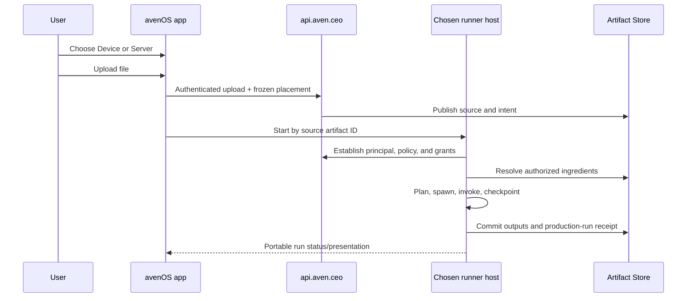
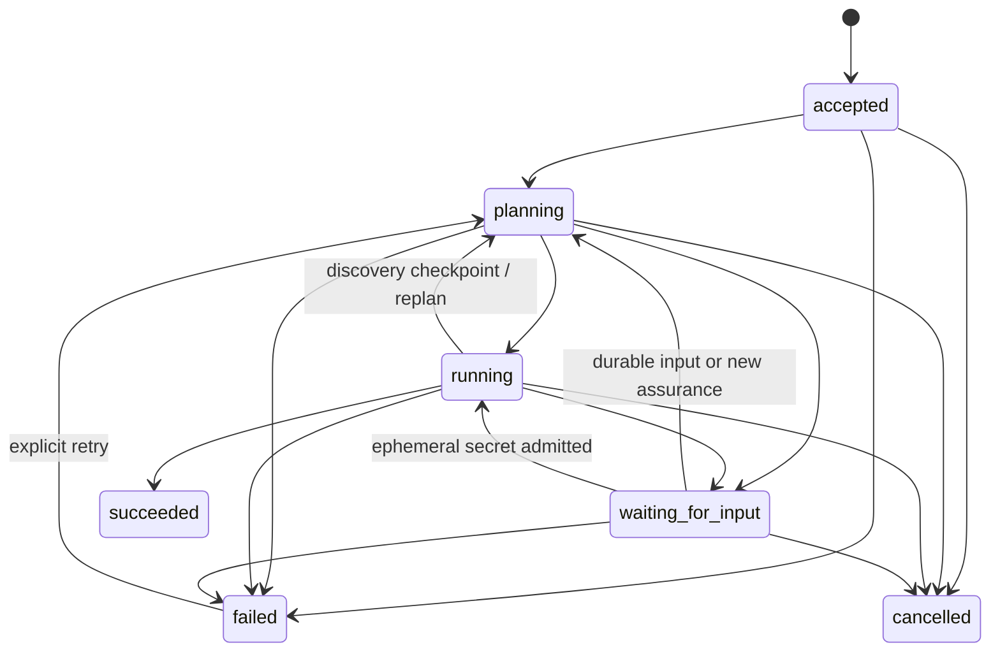

# Actor execution protocol and document-ingest cutover

Status: implementation-ready specification for the experimental actor runtime

Protocol owners: `os.aven` for portable execution, `id.aven` for identity and
authorization evidence, and `ceo.aven` for all avenCEO application, document,
artifact, model, and LLM contracts

Companion: [Actors, skills, planning, and durable execution](./generic-actor-registry-and-runtime.md)

Proof strategy: [Proving actor execution on device and server](./actor-runtime-proof-strategy.md)

The words **MUST**, **MUST NOT**, **SHOULD**, and **MAY** are normative. Code examples
are wire shapes, not invitations to trust fields supplied by an app.

## 1. Decision

One run has one placement: `local` or `server`. The user chooses it before the process
starts. The choice is frozen in the run record, every physical plan segment, every
step attempt, and the processing presentation. Changing the default affects only the
next run.

Both placements implement the same JSON-safe runner protocol. Both resolve and publish
through the same logical Artifact Store scope. Local execution reaches it through the
authenticated avenCEO API. Server execution receives a short-lived, scope-bound grant
from `api.aven.ceo`. Neither host accepts a database name or physical tenant route from
the client.

The app's document `server` option is a `PlanRunnerClient`. It submits only the
committed source descriptor through the authenticated facade, polls the subject-owned
durable run, and accepts a terminal presentation only when it identifies server
placement and the `actor-runner` host. No server decoder or document actor exists in
the client composition.

The repository also contains a real authenticated remote boundary in
`services/actor-runner`. It accepts the protocol through `api.aven.ceo` and verifies
the forwarded signed identity token and tenant grant independently. It persists run
records in the selected customer's PostgreSQL database and reclaims accepted rows on
the first admitted request for that customer after a process restart. Its application
catalog installs the document-ingest skill with a tenant-routed Artifact Store adapter
and headless deterministic decoder. Other skills still fall through to the empty,
fail-closed generic host.



## 2. Ownership and names

Catalog IDs use:

```text
authority:kind:namespace:name@version
```

Predicate functors include the same ownership boundary:

```prolog
ceo.aven.docs.document(D)
ceo.aven.docs.document_profile(D, xrechnung)
ceo.aven.bookkeeping.invoice_details(D)
```

`id.aven` is intentionally narrow. It owns principal identifiers, authentication and
assurance evidence, identity-scoped authorization, and verifiable grant evidence. It
does not own application policy decisions, product entitlements, actors, envelopes,
registries, factories, plans, runs, checkpoints, or continuations.

`os.aven` owns product-neutral execution vocabulary: actor envelopes, registries,
factories, plans, runs, checkpoints, continuations, and generic system actors.
`ceo.aven` owns application behavior: skills, document and bookkeeping facts, schemas,
product entitlements, model selection, prompts, LLM actors, and LLM calls.

In particular, OpenAI compatibility does not make an LLM an identity concern. The
gateway transport may be reusable, but the actor and capabilities are avenCEO
application contracts:

```text
ceo.aven:actor:ai.gateway:llm@1
ceo.aven:capability:ai.gateway.llm:complete@1
ceo.aven:policy:ai.models:selection@1
```

No LLM actor, model capability, prompt policy, or completion receipt is named under
`id.aven` or `os.aven`.

## 3. Wire protocols

The current portable runner protocol is:

```text
os.aven:protocol:actors:plan-runner@2
```

Version 1 remains accepted during rollout for exact-goal commands only.

The document skill adapter is:

```text
ceo.aven:protocol:docs.ingest:document-run@1
ceo.aven:skill:docs.ingest:document-ingest@1
```

Their TypeScript source of truth is
`libs/aven-actors/src/run.ts` and
`libs/aven-document-ingest/src/execution.ts`.

Every value crossing a host boundary MUST be finite JSON made only from null,
booleans, strings, finite numbers, arrays, and plain objects. Dates are ISO strings.
IDs are strings. A plan MUST NOT contain actor objects, functions, class instances,
maps, sets, abort signals, database connections, open files, byte buffers, or secret
values. The in-process server emulator MUST apply the same validation and JSON round
trip as a remote transport.

### 3.1 External start command

An authenticated app sends a command containing intent, not asserted authority:

```ts
interface PlanRunStartCommand {
  protocol: 'os.aven:protocol:actors:plan-runner@2'
  requestId: string
  idempotencyKey: string
  requestedAt: string
  skillRef: SkillId
  executionEnvironment: 'local' | 'server'
  ingredients: Array<{ predicate: string; artifactId?: string }>
  goals: string[]
  goalSpec?:
    | { mode: 'explore'; subject: Ingredient; factFamilies: string[] }
    | { mode: 'exact'; completion: 'goal_only' }
    | {
        mode: 'exact'
        completion: 'goal_then_enrich'
        subject: Ingredient
        factFamilies: string[]
      }
  parameters: Record<string, Json>
}
```

With no `goalSpec`, or with `exact/goal_only`, the run succeeds when every entry in
`goals` is proven by admitted ingredients or committed outputs. `explore` requires no
exact goals and exhausts applicable, authorized, non-effecting capabilities within the
named fact families. `exact/goal_then_enrich` preserves exact goals and then applies
the same enrichment policy. The subject MUST name an admitted ingredient. Version 1
rejects `goalSpec` and retains exact-only behavior.

The initial policy has no caller-controlled effort or budget: it is exhaustive.
Later protocol versions may add explicit utility, budget, confidence, privacy, or
calibrated signal-yield limits. These outcomes MUST NOT be encoded as a magic predicate
whose meaning varies by runner. The product interaction is specified in
[Artifact-first semantic enrichment and affordance discovery](artifact-first-semantic-enrichment.md).

The command MUST NOT contain `principal`, `tenantId`, entitlements, grants, database
names, storage routes, or assurance claims. A server MUST ignore and reject any such
caller-supplied security context.

### 3.2 Admitted internal start request

The trusted host boundary authenticates the caller and stamps:

```ts
interface PlanRunSecurityContext {
  principal: ActorPrincipal
  access: ActorAccessContext
  establishedBy: string
  authorizedAt: string
}
```

For server execution, the caller presents its short-lived `aven.id` token only to
`api.aven.ceo`. The facade verifies the fixed issuer and audience, strips any
caller-supplied trusted headers, replaces the bearer token with an allowlisted service
credential, and forwards `x-aven-subject`, `x-aven-role`, `x-aven-session`, plus the
original signed token in `x-aven-identity-token`. The runner independently verifies
that signed token before application policy evaluates `ceo.aven` entitlements and
resource access and stamps the admitted security context. Coarse identity roles are
not product entitlements.

For local execution, the desktop host obtains equivalent authenticated application
decisions or short-lived grants through `api.aven.ceo`; it does not mint identity,
entitlements, artifact grants, tenant routes, or assurance claims itself.

`requestId` identifies one command attempt. `idempotencyKey` identifies the logical
start operation. Repeating an admitted start with the same principal, scope, skill,
and idempotency key MUST return the existing run. Reusing it with different material
fields MUST return a conflict.

### 3.3 API surface

The remote server runner exposes these authenticated avenCEO endpoints:

```text
POST   /api/actor-runs
GET    /api/actor-runs/{runId}
GET    /api/actor-runs/{runId}/events
POST   /api/actor-runs/{runId}/continuations/{continuationId}
POST   /api/actor-runs/{runId}/cancel
```

These paths are public only through the `api.aven.ceo` facade. Its deployment adds an
exact allowlisted `/api/actor-runs` downstream prefix and a fixed runner origin; a
request can never supply an upstream URL or physical route. Billing prefixes route to
checkout, actor-run prefixes route to the runner, and identity endpoints never enter
either service.

- `POST /api/actor-runs` accepts the external command and returns `202` with a handle.
- `GET` returns the caller-visible run projection; unknown and unauthorized both
  return `404`.
- `events` is an SSE convenience over durable revisions. Disconnecting it does not
  affect execution.
- a continuation submission is accepted only for the named open continuation and
  current run revision;
- cancel is idempotent and cannot undo committed effects.

The desktop implementation presents the same `PlanRunnerClient` interface in-process.

### 3.4 Integration with the service split

The current architecture uses the physical `aven.id` / checkout / facade extraction.
Ownership is resolved as follows:

| Surface | Public entry | Owning downstream |
| --- | --- | --- |
| signup, passkeys, sessions, token issuance | `aven.id` | identity service |
| billing and checkout operations | `api.aven.ceo` allowlist | `portal.aven.ceo` checkout service |
| actor-run commands and events | `api.aven.ceo` `/api/actor-runs` allowlist | `os.aven` runner service |
| artifact reads and publications | `api.aven.ceo` artifact allowlist | Artifact Store adapter |
| model catalog and completions | `api.aven.ceo` LLM allowlist | `ceo.aven` LLM gateway service |

The native app therefore keeps two compile-time origins: `AVEN_IDENTITY_BASE_URL` for
identity ceremonies and `AVEN_API_BASE_URL` for every product/data-plane call. The
current Tauri artifact functions already call the shared `api_endpoint` helper; the
split architecture routes that helper through the facade origin, so this feature MUST
retain that separation when rebased rather than reintroducing identity routing.

The split topology is now the integration base. Public product paths remain facade
paths, so the app and `PlanRunnerClient` do not acquire checkout, runner, or storage
origins. The actor runner is its own downstream service; no runner code belongs in the
isolated identity service. The owning LLM and client-publication downstream
implementations are not included in the current deployment; an integrated deployment MUST add
them behind fixed facade routes without moving their contracts into identity.

## 4. Run state machine



Terminal `succeeded` and `cancelled` records never return to a running state. A failed
run retries only through an explicit command which creates a new revision and attempt.
Repeating status reads has no side effects.

The repository MUST use compare-and-swap revisions and fencing tokens. A worker which
lost its lease MUST NOT publish, checkpoint, or change state. A step succeeds only
after its output artifacts and production-run receipt are committed and the outbox is
acknowledged.

## 5. Durable records

The run repository is operational state, separate from immutable artifacts. A
conforming schema has these logical records; physical SQL names may differ.

| Record | Stable key | Required content |
| --- | --- | --- |
| run | `run_id` | protocol, skill, principal reference, tenant/scope reference, placement, state, revision, goals, timestamps |
| plan segment | `(run_id, ordinal)` | registry revision, authorized physical program, remaining goals, proof inputs |
| step | `(run_id, segment, step_id)` | capability, target offer/instance, bindings, state, retry/effect policy |
| attempt | `attempt_id` | lease owner, fencing token, number, decision IDs, start/finish, error |
| checkpoint | `(run_id, ordinal)` | completed steps, committed artifacts, remaining goals, policy decisions |
| continuation | `continuation_id` | kind, schema, prompt metadata, state; never an ephemeral secret |
| outbox | `publication_id` | exact production-run publication, state, retry data |
| actor lease | `(run_id, instance_id)` | factory/admission, lifetime, expiry, release state |

The repository MUST NOT persist bearer tokens, PDF passwords, raw second factors,
provider credentials, or caller-supplied physical routing. References to principals,
grants, and decisions are retained for audit; renewable credentials are reacquired.

The development database is cleared for this cutover. There is no legacy reader,
fallback, alias, dual write, or migration contract. Rows which do not satisfy this
protocol are invalid.

## 6. Planning and authorization algorithm

For every planning segment the host performs these steps in order:

1. resolve source artifact IDs through an authorized `ArtifactResolver`;
2. project only validated, schema-bound facts into ingredients;
3. obtain a current registry snapshot;
4. ask application policy for an authorized registry view for this principal,
   placement, configuration, entitlements, assurance, and artifact grants;
5. solve the logical goal using only that view;
6. select physical instances or factory offers in the frozen environment;
7. persist the segment before execution;
8. reauthorize spawn and invoke at their respective moments;
9. execute until completion, an observation frontier, a continuation, or failure;
10. commit outputs, project facts, checkpoint, refresh policy/registry, and replan if
    goals remain.

Discovery, plan, spawn, invoke, artifact read, and artifact publish are distinct
decisions. A planning allow is advisory. It cannot be used as an invocation grant.
Denial of one placement triggers safe replanning if an alternative exists; it does not
silently downgrade exact-action approval or assurance requirements.

## 7. Schema and envelope binding

Every invocable method declares `inputSlots` and `outputSlots`. A slot contains:

- a unique method-local name;
- its qualified predicate;
- canonical schema ID;
- production-run role;
- `one`, `optional`, or `many` cardinality; and
- whether it is sensitive.

Example:

```ts
{
  name: 'details',
  predicate: 'ceo.aven.bookkeeping.invoice_details(D)',
  schema: 'ceo.aven:schema:bookkeeping:invoice-details@2',
  role: 'details',
  cardinality: 'one'
}
```

The `ArtifactResolver` validates artifact type/version against the canonical schema
adapter, groups values by role and ordinal, enforces cardinality, and constructs the
envelope payload. The `ArtifactPublisher` performs the inverse operation on the
result, validates output schemas, checks provenance locators, and builds one atomic
production-run publication. The generic runner MUST NOT contain a switch on document
type keys or method names.

The current document actor helper already emits qualified predicates and canonical
slot bindings. `DOCUMENT_SCHEMA_BINDINGS` is the single domain adapter from those
schemas to concrete Artifact Store type keys/versions; the coordinator no longer owns
that mapping. The generic runner will consume the same catalog through its
`ArtifactResolver` and `ArtifactPublisher` ports.

## 8. Dynamic actor lifecycle

The physical plan points at a live advertisement or a factory offer. For an offer the
runner MUST:

1. resolve its qualified factory ID in the chosen host;
2. make a current spawn authorization decision over exact configuration and inputs;
3. call side-effect-free admission;
4. spawn only after admission and record the lease before invocation;
5. advertise the instance and its granted capability subset;
6. reauthorize each invocation;
7. drain and release at the admitted `step`, `run`, `session`, or `shared` boundary;
8. withdraw the advertisement even when release fails, then report cleanup failure.

Factories own construction and teardown. Registry and solver never construct actors.
Spawn request IDs are idempotent. A host MAY shorten a proposed lifetime.

## 9. Human continuations and secrets

An encrypted PDF projects a successful inspection report plus an unresolved secret
requirement. It is not a terminal document failure.

```json
{
  "kind": "secret",
  "schema": "ceo.aven:schema:docs:pdf-password@1",
  "subject": "source-artifact-id",
  "prompt": "Enter the password for this PDF",
  "persistence": "metadata-only"
}
```

The password travels only in an authenticated continuation submission. A `SecretBroker`
returns a run-, continuation-, and attempt-scoped opaque handle to the decoder. The
value MUST NOT be copied into a run record, artifact, production-run parameters,
envelope trace, model prompt, log, crash report, or telemetry. It is destroyed after
the admitted attempt.

Wrong password leaves the continuation open. Postpone changes it to `postponed` and
reopening the intent presents it again. Restart also presents it again. Conversation
steering leaves it unresolved. Cancel is separate. Approval of an effect and identity
step-up use different continuation kinds and evidence rules.

## 10. XRechnung without a coordinator branch

The XRechnung extension contributes at least two actors.

The observer accepts plausible XML or embedded-XML candidates and always emits a
typed recognition report with `recognized`, `ruled_out`, `malformed`, or
`needs_clarification`. Only its validated `recognized` projector adds:

```prolog
ceo.aven.docs.document_profile(D, xrechnung)
```

The extractor requires the document plus that fact and produces:

```prolog
ceo.aven.bookkeeping.invoice_details(D)
```

bound to the same `ceo.aven:schema:bookkeeping:invoice-details@2` schema as the visual
and native-text route. The runner stops at the observer frontier, commits the report,
then replans. It never predicts an observation outcome. Backward relevance ensures it
does not execute every installed recognizer.

Contract tests MUST prove:

- recognized XRechnung chooses structured extraction and performs no vision call;
- ruled-out XML replans to another reachable route;
- malformed XML is represented by a report, not an invented XRechnung fact;
- scanned documents still select a visual route when authorized; and
- every route publishes the identical canonical invoice-details schema.

## 11. Completing the server runtime and document cutover

The split removed the former feed-driven Rust Artifact Processor. There is no current
processor to preserve, wrap, or migrate. Its lease, fencing, attempt, outbox, and
acknowledgement patterns remain useful historical evidence, but the new runner MUST be
generic and MUST start work only from an admitted run command.

The cutover now has four independently testable increments.

### Phase A — portable local parity (implemented and superseded by the remote host)

- use qualified IDs, domain-qualified predicates, and schema-bound capability slots;
- expose Device/Server choice and require it on every new upload;
- route both choices through separate document hosts and a strict JSON boundary;
- keep generated IDs and physical host metadata out of canonical parity comparisons; and
- preserve atomic Artifact Store publication, stable publication IDs, and processing
  projection behavior.

The source's execution-environment field is a temporary start hint, not a run
repository. New data has no legacy fallback or compatibility reader.

### Phase B — authenticated persistent boundary (implemented as a baseline)

- expose the environment-scoped public route family through `api.aven.ceo` and project
  it to the runner's exact private `/api/actor-runs` paths;
- replace the caller bearer with a fixed service credential at the facade;
- forward and independently verify the original signed `aven.id` token and the
  facade's short-lived tenant grant;
- reject caller-supplied principals, grants, tenants, security contexts, and routes;
- select a provisioned customer database without trusting caller routing input;
- enforce subject isolation, SQL-backed start idempotency, strict JSON, portable run
  records, revision-checked cancellation, and recovery of committed `accepted` rows
  after a process restart.

This phase makes the run ledger persistent. Recovery is lazy on the first admitted
request for a customer. The service retains an empty, fail-closed generic fallback;
the later document application executor is deterministic and publishes every step
idempotently.

### Phase C — durable generic executor

The ordered executor core and SQL injection/checkpoint seam cover the smallest
deterministic factory path. A conditional PostgreSQL E2E test also carries that shared
fixture through signed identity, the facade, tenant-grant admission, runner HTTP, SQL
persistence, dynamic factory execution, real Artifact Store publication, and a
canonical local/server comparison. The production service uses the same generic
executor composition as its fallback and now also has one application catalog entry
for document ingestion. The remaining items populate generic application ports and
make effects durable:

1. implement `RunRepository` records, compare-and-swap revisions, leases, fencing,
   attempts, and the publication outbox;
2. connect real `ceo.aven` entitlement, configuration, assurance, and artifact-grant
   decisions to discovery, plan, spawn, invoke, read, and publish;
3. promote the tested Artifact Store resolver/publisher composition from conformance
   fixtures to application schema bindings and fact projectors, then add dispatcher,
   continuation, and secret-broker ports;
4. register document definitions and local/server factory offers as catalog data;
5. execute discovery frontiers and replan only the unfinished suffix; and
6. project generic run state into the current processing UX.

The runner MAY reuse proven relational lease/outbox patterns. It MUST NOT contain a
hard-coded document graph, switch on document type or actor method, or discover work
merely because an artifact appeared in a feed.

### Phase D — application cutover and domain proofs

1. create non-executing shadow plans for representative uploads and compare them with
   the current `DocumentProcessingRuntime` results;
2. prove parity for PDF, image, invoice, statement, unsupported, encrypted, retry,
   crash-after-publication, and model failure fixtures;
3. wire the app's explicit Server choice to `PlanRunnerClient` through the facade
   (**implemented**);
4. keep Device execution behind the same client contract and then move it to the same
   generic runner core;
5. replace eager document actor singletons with authorized factory offers;
6. add encrypted-PDF continuation and XRechnung recognizer/extractor packages without
   changing the generic runner; and
7. remove `DocumentProcessingRuntime` and the `client-actor-ingest` ownership marker
   after parity is established. A source is an artifact; an admitted run owns work.

There is no emulated-server rollback path. Committed artifacts remain valid because
both implementations use stable, idempotent production-run publications. A failed
remote deployment must be repaired or server placement disabled honestly; it must not
silently execute server-labelled work on the device.

## 12. Current conformance and deliberate gaps

| Requirement | Current state | Completion condition |
| --- | --- | --- |
| qualified IDs and predicates | implemented | catalog validation in CI |
| generic runtime ownership under `os.aven` | implemented | generated catalog rejects runtime contracts under `id.aven` |
| all LLM ownership under `ceo.aven` | implemented for client/domain contracts; split downstream absent | add the dedicated downstream and reject `id.aven`/`os.aven` LLM catalog entries |
| authorized registry and physical placement | implemented contracts/planner | wire to real application policy |
| dynamic factory admission | implemented in the ordered executor core | compose production factories and policies in each host |
| portable runner protocol | implemented with persistent server ledger and authenticated generic-executor test seam | compose the production local and server hosts around it |
| Device/Server start choice | implemented | UX and restart tests remain green |
| server runtime boundary | authenticated HTTP service, persistent SQL run ledger, remote desktop client, document application executor, and empty fail-closed generic fallback | add leases/fencing before effectful generic applications |
| shared Artifact Store | local and server document paths publish into the selected customer scope with distinct service credentials; generic adapter also has Rust/PostgreSQL persistence/replay proof | extend generic application schema bindings as services are added |
| slot/schema bindings | manifests plus one-artifact-per-slot generic executor binding implemented | add wider cardinalities and production schema/store adapters |
| durable generic runner | ordered factory-executor core, final-state server host composition, authenticated SQL, real Artifact Store publication, checkpoints, and a metadata-only secret continuation implemented for deterministic fixtures | add application adapters, leases, fencing, retries, secret handles, and checkpointed replanning |
| encrypted-PDF continuation | generic postpone/restart/resume lifecycle implemented and tested; document integration specified | decoder secret-handle contract, document executor binding, and HITL UI |
| XRechnung observation/replanning | specified | recognizer/extractor package and tests |
| former feed-driven processor | removed | do not reintroduce artifact-arrival execution |

This table is intentional. “The architecture can satisfy the paper” means every
feature has a named contract and replaceable boundary; it does not mislabel the
document-specific coordinator or unimplemented secret broker as a completed generic
runtime.

## 13. Required conformance suite

Conformance proves the portable actor infrastructure; it MUST NOT be presented as
proof that a real document parser, OCR model, or bookkeeping extractor is correct.
Document acceptance and live-provider smoke tests are separate proof rails. Each rail
MUST identify the placement it exercised. The proof strategy linked above defines the
fixtures, canonical comparison manifest, failure matrix, and incremental delivery
order.

A runner is conforming only when automated tests cover:

1. wire round trips reject functions, cycles, non-finite numbers, and class instances;
2. the start idempotency key cannot be rebound to different material input;
3. local and server plans contain placements only from their frozen environment;
4. unauthorized actors are absent before logical search and rechecked at invocation;
5. factory denial causes replan and leaks no actor resource;
6. a lost fencing token cannot publish or checkpoint;
7. crash before acknowledgement replays one stable publication;
8. output artifacts and receipt commit before step success;
9. invalid or unversioned persisted records are rejected rather than reinterpreted;
10. an encrypted PDF suspends, postpones, reappears, resumes, and never persists its
    password;
11. XRechnung selects structured extraction without a coordinator branch;
12. local and server fixture runs produce equivalent canonical artifacts and
    provenance; and
13. generic execution protocols and system actors use `os.aven`, while `id.aven` is
    limited to principal, authentication, assurance, authorization, and grant evidence;
14. no catalog item describing an LLM interaction uses the `id.aven` or `os.aven`
    authority; and
15. the facade strips forged identity headers, uses a fixed runner route, and the
    runner independently verifies the forwarded signed identity token.

Items 1–15 SHOULD use deterministic test-only actors and fixtures and MUST run against
both the production local runner core and the separately hosted persistent server
runner. The cross-placement assertion compares portable outcomes and provenance
semantics. It does not require equal generated identifiers or equal physical plans
when placement and authorization expose different implementations.

The current suite automates item 2; the core-level portions of items 3, 4, 8, and 12;
the protocol-authority constants needed by item 13; and item 15's trust boundary. The
item 4 evidence includes both pre-search removal of an unauthorized cheaper target in
favor of a higher-cost fallback and fail-closed invocation reauthorization. The
item 12 evidence includes the generic deterministic fixture carried through
authenticated runner HTTP, a real SQL repository, and the real Rust Artifact Store.
Document-specific conformance additionally runs the real browser and headless decoders
over text, CSV, and native-text PDF goldens and compares canonical output graphs. The
fresh-stack Tauri proof crosses separate identity, facade, runner, and Artifact Store
containers for both placements and requires the durable server checkpoint.
Representative strict-JSON cases from item 1 are covered, but not yet every value class
named there. A focused LLM actor test covers the central item 14 example; the exhaustive
catalog rule still waits for the generated catalog gate.

The generic part of item 10 now has a deterministic server proof: the runner persists
only an open metadata request, survives process replacement, records postponement,
accepts the secret through the authenticated continuation route, and stores no submitted
value in the public record or PostgreSQL JSON. It is not yet an encrypted-PDF acceptance
test: the decoder, attempt-scoped secret handle, and app presentation are absent.

`services/actor-runner/tests/split-architecture.e2e.test.ts` starts real ephemeral
JWKS, facade, and runner HTTP services, signs an EdDSA identity token, and proves both
successful admission and fail-closed handling of forged projections and
caller-supplied security. With `TEST_ACTOR_RUNNER_DATABASE_URL`, it additionally uses
`SqlPlanRunner` and the shared deterministic executor fixture to persist a completed
step and compare its canonical output with local execution. When the Artifact Store
test variables are also present, it commits the output and lineage through the real
service and checkpoints the returned artifact ID. This does not yet prove recovery in
the publication/checkpoint gap or leases.

The growing document acceptance corpus must separately cover native text, visual documents,
canonical finance schemas, XRechnung recognition, encrypted-PDF continuation, and
unsupported inputs on every supported placement. Live LLM/provider checks remain a
third, separately reported smoke rail; model availability or a plausible answer is
not runtime conformance.

## 14. Documentation gate

The protocol, package READMEs, generated actor catalog, schema catalog, and examples
are deliverables. A capability change MUST update its manifest, tests, and generated
documentation in the same pull request. CI SHOULD fail on duplicate IDs, unknown
authorities, unqualified first-party predicates, missing schema bindings, stale
examples, undocumented continuation behavior, and any LLM contract outside
`ceo.aven`.
It SHOULD also reject actor/run/factory/registry contracts under `id.aven`; those
belong to `os.aven`.

The formal spec changes only with a protocol or architecture decision. Generated
catalogs answer what exists. Package READMEs teach construction and use. Keeping those
roles separate makes the documentation both maintainable and useful.
