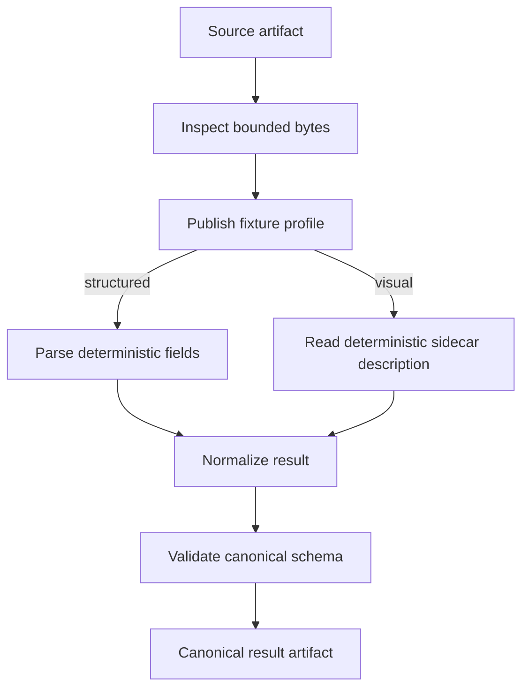
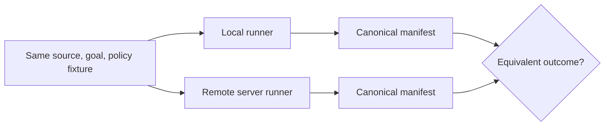

# Proving actor execution on device and server

Status: testing strategy and incremental delivery plan

Normative protocol: [Actor execution protocol and document-ingest cutover](./actor-runtime-formal-spec.md)

System map: [Document ingest system architecture](./document-ingest-system.md)

Artifact-first extension:
[Artifact-first semantic enrichment and affordance discovery](./artifact-first-semantic-enrichment.md)

## Start with the claim

“The document imported successfully” sounds like one claim. It is at least three:

1. the actor infrastructure discovered, authorized, planned, executed, persisted, and
   resumed work correctly;
2. the document actors interpreted this kind of document correctly; and
3. the configured external services behaved as expected at that moment.

One large test cannot tell us which claim failed, and one passing happy path cannot
prove all three. We therefore maintain three independent proof rails:

| Proof rail | Question it answers | Primary dependencies |
| --- | --- | --- |
| Runtime conformance | Can any admitted skill execute correctly on this host? | Registry, policy view, planner, factory, runner, Artifact Store |
| Document acceptance | Do the real document capabilities produce correct domain facts? | PDF/image adapters, document actors, schemas, deterministic model fixtures |
| Provider smoke | Can the deployed external integrations still satisfy their contracts? | LLM gateway, live model catalog, selected providers |
| Provider-backed document acceptance | Does the selected real model still recover the expected semantics from the reviewed golden corpus? | Golden documents, production prompts and schemas, live model lane |

Every supported execution model—currently client-hosted `local` and remotely hosted
`server`—MUST pass the relevant rail. A local pass is not evidence for the server, and
an in-process server emulation is not evidence for the remote server runner.

## The proof boundary

Runtime conformance deliberately uses small deterministic actors. Its fixtures may be
files and its graph may resemble document ingestion, because that gives us realistic
fan-out, alternatives, schema convergence, and human continuation. The actors do not
use PDF.js, OCR, an LLM, or bookkeeping heuristics. A pass proves the execution
machinery, not document understanding.

Document acceptance deliberately uses the real document actors and a curated corpus.
In ordinary CI, model-backed stages receive deterministic recorded responses or a
contract-compatible fake gateway. A pass proves the domain transformation for those
fixtures, not the availability or future behavior of a live provider.

Provider smoke tests are intentionally narrow. They prove that current credentials,
catalog entries, modalities, streaming, structured outputs, and tool calls work
against a live service. They do not replace deterministic acceptance tests.

Provider-backed document acceptance is an extended, credentialed E2E rail. It runs
the original golden documents through the production model path and compares their
normalized semantic results, evidence coverage, and downstream affordances with
reviewed expectations. It does not replace the deterministic merge gate; the two rails
together distinguish a pipeline regression from model or prompt drift.

This vocabulary should appear in test names, CI jobs, and release notes. Avoid the
unqualified phrase “document E2E”; say which proof rail and which placement passed.
Call infrastructure inputs **runtime conformance fixtures**. Reserve **golden
documents** for the reviewed domain corpus with expected semantic results.

## Evidence available today

The repository starts from useful but incomplete evidence:

| Executable evidence | What it proves | What it does not prove |
| --- | --- | --- |
| `deploy/e2e/platform.spec.ts` native Tauri imports | The same deterministic text fixture crosses authentication and the native file reader on both placements. The local path runs in Tauri; the server path crosses the facade, persistent Actor Runner, and tenant Artifact Store. The test compares the complete stored derived-artifact graph, payloads, lineage, and blob hashes | PDF/OCR/model behavior and generic-planner document execution |
| `app/tests/document-actors.test.ts` | The current document DAG, stable publications, retry behavior, model lane with deterministic fakes, and placement freezing | A separately hosted server or live providers |
| `services/actor-runner/tests/document-lane-conformance.test.ts` | Real browser and headless server decoders run the same deterministic text, CSV, and repository PDF goldens. The suite compares canonical presentations and every publication, input, payload, blob hash, evidence item, and derived graph edge | Scanned-image OCR, live models, or independently deployed processes |
| `libs/aven-actors/tests/executor-conformance.test.ts` | The first generic executor slice plans, admits factory actors, binds schema-qualified artifacts, publishes, releases, excludes an unauthorized cheaper actor in favor of an equivalent fallback on both placements, and produces equivalent canonical results | A remote process, persistent run state, retries, fencing, continuations, or the real Artifact Store |
| `services/actor-runner/tests/host.test.ts` | The generic fallback uses the portable planner/executor shape, accepts a valid zero-step plan, rejects the wrong placement, and fails closed when its catalog is empty | Application-specific behavior, which is covered by its own executor tests |
| `services/actor-runner/tests/split-architecture.e2e.test.ts` | Identity, facade, tenant grant, server-runner HTTP, and anti-forgery boundaries; with PostgreSQL and the conformance Artifact Store enabled, the same deterministic skill crosses that authenticated path, commits real output lineage, persists the returned artifact ID in its SQL checkpoint, and matches the local canonical outcome | Independent service processes, a production local runner host, leases, fencing, or recovery during an actor effect |
| `services/actor-runner/tests/sql-runner.persistence.e2e.test.ts` | A committed accepted run survives process replacement; concurrent recovery uses a PostgreSQL session claim so only one executor runs and commits one checkpoint; the shared deterministic executor fixture dynamically runs a server factory actor, persists its checkpoint evidence, and matches its local canonical outcome | The public trust path, the real Artifact Store, fencing after a database connection is lost, or recovery during an actor effect |
| `services/actor-runner/tests/artifact-store-port.test.ts` | The concrete runtime adapter projects facts from registered store types, rejects an unprojected caller fact, derives a stable publication UUID, and sends an atomic production-run command with ordered lineage | A real Rust/PostgreSQL commit, scoped deployment credentials, publication replay after a crash, or runner composition |
| `services/actor-runner/tests/artifact-store-port.persistence.e2e.test.ts` | The concrete adapter commits through the real Rust service and PostgreSQL, reads the output and producer inputs back, and idempotently replays the production-run publication | Tenant-grant-derived artifact authority or crash recovery between publication and checkpoint |

The first cross-placement infrastructure slice now executes one shared deterministic
source through the local executor core and the authenticated SQL-backed server path,
then compares canonical outputs and provenance. In the release harness, the server
path resolves its source and atomically publishes its result through the production
Rust Artifact Store; the SQL checkpoint contains that returned durable artifact ID.
It is not yet the complete parity claim: the local side is not composed as the
production app's generic `PlanRunner`, and the ephemeral identity, facade, and runner
HTTP servers share a test process rather than independently deployed containers.

## Runtime conformance journey

The first conformance skill should be useful enough to exercise the architecture and
simple enough to understand without knowing the document domain. A source fixture
contains a small marker and key/value body. Test-only capabilities form this graph:



The capabilities MUST be ordinary catalog entries with versioned input and output
slots. They MUST enter through the same principal-scoped registry, planner, factory,
envelopes, resolver, publisher, checkpoints, and Artifact Store used by application
actors. Test code may supply the actor implementations; it MUST NOT bypass the runtime
by directly calling their methods.

Use the test-only `os.aven.testing.*` predicate namespace and matching catalog
namespaces; exclude them from production catalogs. Do not publish `ceo.aven.docs.*`
or `ceo.aven.bookkeeping.*` facts from these actors: that would make an infrastructure
proof look like domain evidence.

### What the journey observes

For each placement, the test starts from an authenticated public command and observes
only supported interfaces. It proves:

1. caller security assertions are rejected and the trusted boundary establishes the
   principal and customer scope;
2. unauthorized capabilities are absent before search;
3. the planner selects a reachable, schema-compatible program;
4. the factory admits and creates only the actors named by the physical plan;
5. envelope inputs resolve from committed artifact IDs and declared slots;
6. each successful step atomically publishes outputs and provenance before it is
   checkpointed;
7. retries reuse stable publication identities;
8. actor instances drain and are released at their declared lifetime boundary; and
9. the final predicates and canonical result are available through the public API.

The test should retain a compact run manifest as its comparison surface:

```ts
interface ConformanceManifest {
  terminalState: 'succeeded' | 'failed' | 'suspended' | 'cancelled'
  fulfilledPredicates: string[]
  remainingGoals: string[]
  outputs: Array<{
    role: string
    typeKey: string
    schemaVersion: number
    contentDigest: string
  }>
  provenance: Array<{
    capabilityId: string
    inputRoles: string[]
    outputRoles: string[]
  }>
  warnings: string[]
  continuation?: { kind: string; state: string }
}
```

Canonicalization sorts unordered collections and removes representation details such
as artifact UUIDs, run UUIDs, timestamps, attempt IDs, host names, model request IDs,
and physical storage routes. Those values remain auditable in the real records; they
are not semantic equality criteria.

## Local/server equivalence

The two placements implement one protocol and satisfy one outcome contract, but they
need not perform identical work:



The parity test MUST compare terminal state, fulfilled and remaining predicates,
canonical output schemas and digests, warnings, continuation semantics, and
provenance roles. It MUST NOT require equal generated IDs, timings, or actor instance
identities.

Execution paths are compared separately:

- If both hosts advertise the same authorized capability set and configuration, a
  planner conformance case SHOULD require the same logical plan.
- If placement or policy exposes different implementations, the physical plans MAY
  differ. The test requires both plans to satisfy the same goal and output contract.
- When a policy intentionally changes the result—such as withholding a sensitive
  capability—the fixture is not a parity case. It is an authorization case with
  placement-specific expected outcomes.

The local side MUST use the production local document runtime. The server side MUST
cross `api.aven.ceo`, reach the separately hosted actor runner, use its
customer-scoped persistent repository, and publish through scoped Artifact Store
access. A server-labelled execution inside the desktop process is forbidden and does
not satisfy this proof.

## Failure and continuation matrix

The happy path establishes the first vertical slice. The same deterministic skill can
then prove hard operational properties without introducing document ambiguity:

| Scenario | Required observation |
| --- | --- |
| Duplicate start | One logical run for one idempotency key and material command |
| Crash after admission | A new process reclaims the accepted run |
| Crash after actor result, before publication acknowledgement | One committed publication after replay |
| Crash after publication, before checkpoint | Replay recognizes the stable publication and does not repeat the effect |
| Concurrent recovery | Lease and fencing permit only the current owner to publish |
| Factory denial | Denied actor is not created; planner selects another route or reports no authorized plan |
| Grant loss before invocation | Invocation fails closed and no output is published |
| Human continuation | Run suspends durably, can be postponed, and resumes from committed artifacts |
| Secret continuation | Durable state contains the request, never the submitted secret |
| Cancellation | No new attempts start; late fenced results cannot commit |

These cases prove generic runtime behavior. Encrypted-PDF acceptance later reuses the
already-proven secret-continuation mechanism with the real decoder.

## Document acceptance corpus

Once a placement passes runtime conformance, the document suite asks whether real
capabilities produce correct, schema-valid facts. The initial corpus should grow in
small, reviewable slices:

| Slice | Fixture | Principal assertion |
| --- | --- | --- |
| Native text | UTF-8 text and native-text PDF | Extracted text and byte/page references are exact |
| Visual document | Small scanned PDF/image | Recorded vision response becomes the expected canonical content |
| Invoice | Representative invoice | Canonical invoice schema and deterministic validation are correct |
| XRechnung | Valid, malformed, and ruled-out XML | Recognition selects structured extraction only when proven |
| Encrypted PDF | Password-protected fixture | Processing suspends, postpones, resumes, and never persists the password |
| Unsupported input | Bounded invalid/unsupported file | Typed report and terminal behavior are stable |

Each corpus entry records the source license or provenance, expected predicates,
canonical output payloads, expected warnings, and which stages may use recorded model
responses. Sensitive production documents MUST NOT become fixtures.

The corpus runs on both local and server placements. Domain assertions are evaluated
for each placement; the canonical manifests are then compared when policy and
capabilities are equivalent. This produces two independent statements:

- both implementations passed document acceptance; and
- both implementations satisfied the same portable outcome contract.

## Provider smoke rail

Provider tests run outside the deterministic merge gate or in a separately labelled
release job. They use small non-sensitive fixtures and capped budgets. At minimum they
check:

- catalog discovery by required capability and explicit model ID;
- text and image input for the advertised modalities;
- streaming termination and usage accounting;
- JSON-schema response validation;
- tool-call request and response shapes; and
- fail-closed handling when a requested capability is not available.

Record the gateway version, selected model ID, provider, time, request correlation ID,
and structural result. Do not maintain a golden prose answer for a live generative
model.

## Provider-backed document acceptance rail

This extended rail runs before release and when a model, prompt, extraction schema, or
gateway policy changes. It sends the reviewed golden documents through the actual
production extraction route and compares canonical structured values and their
evidence with fixture-defined expectations. It does not compare free-form prose or raw
JSON serialization.

Each run records the exact model, prompt, schema, Actor, gateway, placement, and corpus
versions. Critical identity, date, currency, total, tax, and payment-reference fields
match after canonical normalization. Fixtures declare tolerances for optional fields
and evidence coverage. Repeated runs report field accuracy, whole-document pass rate,
and intermittent failures. The detailed semantic matcher and artifact-first journey
are defined in the
[artifact-first specification](./artifact-first-semantic-enrichment.md#provider-backed-golden-e2e).

Missing credentials, provider unavailability, or an unadvertised modality produces
missing release evidence, not a pass. A current model result never rewrites its own
golden expectation; expectation changes require review.

## Delivery in small slices

The order below keeps every increment executable while preserving the larger design:

1. **Name the rails and current evidence — complete.** This strategy and the test names
   distinguish runtime, domain, and provider behavior.
2. **One local deterministic journey — executor slice complete.** The shared fixture
   runs through the generic registry, planner, factory, and executor; the production
   app still needs a generic local `PlanRunner` composition.
3. **One remote deterministic journey — durable vertical slice complete.** The server
   binary now composes the generic host shape with an empty fail-closed application
   catalog. In the release harness, the same host ports are populated for the fixture,
   which crosses identity, facade, tenant grant, runner HTTP, PostgreSQL, the generic
   executor, and the real Artifact Store. The terminal SQL checkpoint references the
   committed output whose production-run lineage is read back from the store.
4. **Cross-placement comparison — durable vertical slice complete.** The test compares
   canonical outputs and provenance from the local executor and the real-store-backed
   authenticated server path. Repeat it through the production local runner host.
5. **One recovery cut — admission gap complete.** A replacement SQL runner reclaims a
   committed `accepted` row. Next terminate during a stable publication and prove
   recovery from the persistent run repository.
6. **Real Artifact Store publication — composed persistence slice complete.** The
   concrete port has trusted fact projection, schema/procedure bindings, stable
   publication IDs, canonical wire tests, and a real Rust/PostgreSQL replay test. The
   authenticated SQL executor also uses that port in the release-gated conformance run.
7. **One authorization alternative — complete at executor level.** Denying the cheaper
   actor during the principal-scoped planning projection makes both hosts choose and
   instantiate only the authorized higher-cost fallback while preserving the result.
8. **One continuation — durable runner slice complete.** A deterministic secret request
   suspends, survives runner replacement, can be postponed, resumes through the
   authenticated facade, and reaches a checkpoint without the submitted value appearing
   in either the public record or its PostgreSQL JSON. The document decoder, secret
   handle, and HITL presentation remain application work.
9. **Promote real document slices.** Move native text, visual recognition, invoice,
   XRechnung, and encrypted PDF into the document acceptance matrix one at a time.
10. **Add provider smoke.** Keep live integration evidence distinct from merge-blocking
   deterministic tests.
11. **Add provider-backed golden acceptance.** Run the reviewed document corpus through
    the real model path before release and report semantic drift separately from
    deterministic conformance.

The first three slices should remain intentionally small. They do not need a general
workflow language, every lifecycle mode, or every document actor. They do need to use
the final protocol boundaries so later slices extend the proof instead of replacing
it.

## CI and evidence

CI should report the rails separately, for example:

```text
runtime-conformance / local
runtime-conformance / server
runtime-conformance / parity
document-acceptance / local
document-acceptance / server
document-acceptance / parity
provider-smoke / gateway
provider-document-acceptance / golden-corpus
```

A job summary records the commit, fixture-corpus revision, runner protocol version,
catalog revision, placements exercised, and manifest comparison result. A skipped
server or provider job is reported as missing evidence, never as a pass.

Release documentation may claim only what the named jobs establish. The current
evidence proves native client and authenticated remote document execution, canonical
local/server equivalence for the deterministic text, CSV, and native-text PDF corpus,
stored-graph equivalence for text in the fresh-stack journey, one deterministic generic
execution slice, and the remote trust/persistence boundary. It does not prove server
OCR, live model equivalence, generic-planner document execution, leases, or fencing.
