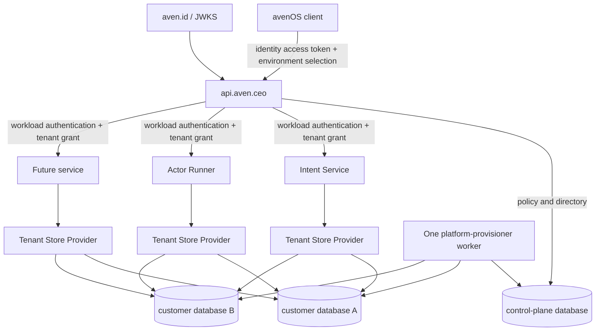
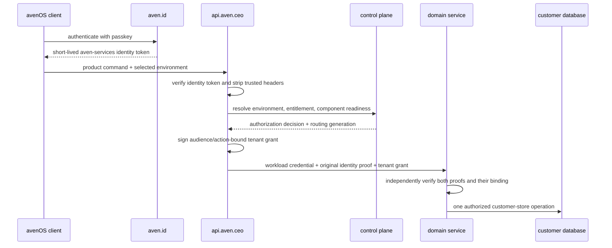

# Customer databases as a first-class platform boundary

Status: normative target architecture for the fresh split deployment

Date: 2026-08-29

Product context: [Product model](product-model.md)

Implementation note: the foundation is now present in this repository and proven by
the fresh-stack E2E suite. The exact implemented surface and the explicitly deferred
operator/runner hardening are tracked in the
[customer-database system map](customer-database-system-map.md); target language in
this paper remains intentional where it defines later lifecycle behavior.

## Decision

Every durable piece of customer-owned domain and application data in avenOS lives in
that customer environment's own database. Identity, commerce, tenant-directory, and
reconciliation control state are deliberate global exceptions with their own bounded
databases. A shared service process may serve many environments, but it selects exactly
one customer database for each admitted operation.

This is a platform invariant, not an implementation detail of Artifact Store, Intent
Service, or Actor Runner. Every future data-bearing service joins the platform through
the same four first-class facilities:

1. a versioned **customer component manifest**;
2. a deterministic **provisioning and reconciliation engine**;
3. a fail-closed **tenant authorization and database-routing rail**; and
4. a reusable **conformance suite** which proves isolation and lifecycle behavior.

The central control plane stores identity-independent customer lifecycle facts and the
operational state needed to repair a customer database. Domain records, actor-run
journals, intents, artifacts, and other customer-owned values stay in the customer
database.

The boundary is physical:

```text
customer environment A -> PostgreSQL database cust_a
customer environment B -> PostgreSQL database cust_b
```

Row predicates in a shared product database are not an alternative implementation of
this rule. A service which cannot operate through a selected customer database is not
ready to join the server-side product surface.

## The deliberately boring deployment

This design does **not** introduce Kubernetes, a distributed scheduler, service
discovery, dynamic plugins, or a provisioner fleet. The first production shape is:

```text
Hetzner identity host
└── Docker Compose: Caddy + aven.id + identity PostgreSQL

Hetzner platform host
└── Docker Compose
    ├── Caddy
    ├── api.aven.ceo
    ├── portal.aven.ceo
    ├── one platform-provisioner worker
    ├── Intent Service
    ├── Actor Runner
    ├── future domain services
    └── one PostgreSQL cluster
        ├── platform/control databases
        ├── cust_a
        └── cust_b
```

Component manifests are ordinary version-controlled files compiled into the
provisioner image. Reconciliation is one loop backed by PostgreSQL tables and advisory
locks. Docker Compose restarts the process. Adding another host or database cluster is
an extension seam, not work required for the first deployment.

The exact implemented containers, databases, roles, routes, grants, secrets, source layout,
and delivery slices are mapped in the companion
[Implemented customer-database system map](customer-database-system-map.md).

## Why this is a platform primitive

Database-per-customer gives avenOS one understandable unit for isolation, backup,
restore, export, residency, suspension, and eventual deletion. It also limits the
amount of unrelated customer data involved in an operational mistake.

Without a shared platform mechanism, every new service would still have to solve:

- how an authenticated subject selects an authorized customer environment;
- how an internal service learns that environment without trusting request headers;
- how its schema and database roles are installed in new and existing databases;
- how partial or ambiguous provisioning is retried safely;
- how migrations are rolled out across all customer databases;
- how routing is invalidated after suspension, transfer, or restore;
- how connection pools are bounded and evicted; and
- how isolation is proven automatically.

Solving these independently would create many subtly incompatible trust and recovery
models. The first-class platform turns those decisions into one paved road while
leaving each service responsible for its own domain schema and behavior.

## Scope

This paper specifies:

- stable customer-environment identity and physical database routing;
- the division between the control plane and customer data plane;
- component registration, installation, migration, suspension, and verification;
- the reconciliation job model and its failure semantics;
- authorization grants for customer-data requests;
- runtime connection management;
- backup, restore, deployment, and schema compatibility expectations;
- the contract a new service must implement; and
- the automated evidence required before a component is production-ready.

It does not specify a universal domain repository, a generic SQL API, one process per
customer, a distributed transaction across databases, dynamic actor planning for
database lifecycle work, or a general-purpose orchestration platform.

## Terminology

| Term | Meaning |
| --- | --- |
| Subject | Stable identity established by `aven.id`; authentication alone grants no customer access |
| Customer environment | Stable product and lifecycle boundary selected by an opaque environment UUID |
| Customer database | Physical database currently implementing one customer environment |
| Physical locator | Server-controlled reference used to reach a customer database; never public authority |
| Component | One bounded service context installed in a customer database |
| Component definition | Immutable, versioned contract describing one component and its lifecycle |
| Desired state | What the control plane requires for an environment and component |
| Observed state | What the current reconciliation attempt most recently proved about the physical database |
| Routing generation | Monotonic fence invalidating grants and pools after a binding or lifecycle change |
| Tenant grant | Short-lived signed application authorization for one environment, audience, and action set |
| Reconciliation | Repeated comparison of desired and observed state followed by bounded repair |

An environment UUID is the stable tenant identity. A database name, hostname,
connection string, purchased name, artifact scope, identity subject, or email address
is not the tenant identity. Any of those may change or have a many-to-one relationship
with the environment over time.

## Non-negotiable invariants

### Customer membership permissions

The facade reads current membership for every admitted operation. Identity-wide admin
status does not replace customer membership. Signed grants carry `membershipRole`, and
signing and verification both enforce this default-deny component/action matrix:

| Component | Owner and admin | Member |
| --- | --- | --- |
| Artifacts | Read and write | Read and write |
| Intents | Read, write, delete and merge | Read and write |
| Actor runs | Read and write | Read and write |

Unknown roles, components and actions fail closed. Adding a service or action requires
an explicit matrix decision. Membership changes affect new facade requests immediately;
an already-issued downstream grant remains bounded by its short expiry and route fencing.

### Platform invariants

1. **One customer environment maps to one physical customer database at a time.** A
   migration may prepare a replacement, but only one routing generation is writable.
2. **Customer-owned durable state is never stored in a shared product database.**
3. **Clients never provide physical routing.** Database names, hosts, URLs, roles, and
   trusted routing headers are rejected at public boundaries.
4. **Authentication and product authorization remain separate.** `aven.id` proves the
   subject and assurance; `api.aven.ceo` decides customer access.
5. **Every downstream service verifies its audience-bound tenant grant.** A workload
   credential alone is insufficient customer authority.
6. **Each component owns one schema and each executable function has its own database
   role.** A role is scoped to one customer database; no login is reused across
   customer databases. API handlers, background workers, migration ownership, and
   operator inspection are separate capabilities. Runtime processes never receive DDL
   or cluster-administration credentials.
7. **Provisioning is asynchronous, idempotent, level-triggered, and coordinated by
   PostgreSQL.** It does not claim cross-database atomicity or exactly-once external
   effects.
8. **A component becomes ready only after independent postcondition verification.** A
   successful process exit or HTTP response is not proof of readiness.
9. **Unknown state fails closed for writes.** Stale grants, stale routing generations,
   unverifiable schema state, and ambiguous restore history deny mutation.
10. **Every new component passes the same multi-customer conformance suite.** Local
    happy-path tests are not isolation evidence.

## Responsibility boundaries

| Owner | Durable state | Responsibilities | Must not own |
| --- | --- | --- | --- |
| `aven.id` | Identity database | Signup, passkeys, sessions, identity JWTs, JWKS | Customer entitlements, environment selection, physical routing |
| `portal.aven.ceo` | Commerce database | Checkout, payment events, subscriptions, purchase workflow | Customer domain records or authentication credentials |
| `api.aven.ceo` control plane | Platform database | Environment directory, product policy, desired component state, reconciliation jobs, routing generations, audit | Customer domain records or arbitrary SQL proxying |
| Platform provisioner | Operational state only | One Compose worker for physical database/role lifecycle and component installation | End-user APIs, domain policy, or arbitrary remote execution |
| Domain service | Customer-owned schema | Its API, repository, validation, and runtime behavior | Other components' schemas or customer selection policy |
| Actor Runner | Customer-owned run schema | Plans, attempts, leases, checkpoints, continuations, outbox | Identity or physical routing authority |

Control-plane state is intentionally central. The reconciler must remain able to see a
failed, absent, suspended, or unreachable customer database. This does not weaken the
customer-data rule: reconciliation attempts and observed-state records are operational
facts about repair, not the customer's domain truth.

## Topology



The arrows to both customer databases represent a bounded shared runtime, not a single
request touching several databases. One admitted operation resolves one environment,
one routing generation, and one customer store.

## Customer component model

### Qualified component identity

Component identities use the same ownership discipline as other portable platform
contracts:

```text
authority:kind:namespace:name@contract-version
```

Examples:

```text
ceo.aven:component:data:intents@1
os.aven:component:actors:run-repository@1
ceo.aven:component:data:artifact-store@1
```

The contract version describes the manifest and external behavior. It is distinct from
the installed database schema version and the deployment image digest.

Neutral provisioning and reconciliation protocols belong to `os.aven`. Product
components, entitlements, and domain actions belong to `ceo.aven`. Nothing in this
catalog belongs to `id.aven` merely because a request eventually carries identity
evidence.

### Component manifest

Each component publishes one machine-readable manifest from its source package. The
manifest is immutable for a published contract version and includes at least:

```ts
interface CustomerComponentManifest {
  componentRef: string
  contractVersion: number
  schema: string
  targetSchemaVersion: number
  migrationSetDigest: string
  compatibleRuntime: {
    minimumSchemaVersion: number
    maximumSchemaVersion: number
  }
  dependencies: Array<{
    componentRef: string
    minimumSchemaVersion: number
  }>
  ownerRoleSuffix: string
  functionRoles: Array<{
    kind: string
    roleSuffix: string
    grantsFile: string
    connectionLimit: number
  }>
  lifecycle: {
    provision: string
    verify: string
    suspend: string
    resume: string
  }
  retrySemantics: 'idempotent' | 'reconcilable'
  backupRequired: true
}
```

The actual schema is versioned in the repository. A small build step combines the
committed manifests into a static catalog embedded in the provisioner image. CI rejects
duplicate component identities, schema ownership collisions, unknown dependencies,
dependency cycles, missing migrations, changed historical migration digests, and stale
documentation. There is no catalog server or dynamic plugin registry.

### Definitions, implementations, and installations

Three values remain deliberately separate:

1. A **component definition** says what one version means.
2. A **provisioner implementation** says how the platform can establish and verify it.
3. A **component installation** records what a specific customer database currently
   contains.

Knowing that a component exists in the catalog does not mean every customer should
receive it. Having a provisioner implementation available does not mean it is healthy
or authorized. An installation is ready only when its exact schema version and
migration digest have been observed in that environment's current routing generation.

### Schema ownership inside a customer database

A customer database may contain several component schemas:

```text
cust_<opaque>
├── aven_platform      # installation metadata; provisioner-controlled
├── artifact_store     # Artifact Store-owned
├── aven_intents       # Intent Service-owned
├── aven_actor_runs    # Actor Runner-owned
└── future_component   # future bounded context
```

Components do not query or mutate one another's tables directly. Cross-domain work
uses an owning service API or an explicitly versioned database contract. Co-location
is an isolation and recovery choice, not permission to create a distributed monolith
inside PostgreSQL.

The `aven_platform` schema contains only physical installation evidence such as:

```text
component_ref
contract_version
schema_version
migration_set_digest
installed_at
verified_at
routing_generation
```

Only the provisioning role writes this metadata. Runtime roles may read the row needed
for startup compatibility checks but cannot forge installation success.

## Control-plane records

The control database contains a generic component registry instead of adding another
service-specific column for every new backend.

### Environment directory

```text
customer_environments
  environment_id              stable UUID
  owner/customer reference    product policy input
  desired_state               ready | suspended | erasing
  observed_state              pending | ready | suspended | failed | unknown
  physical_locator_reference  encrypted or opaque server-side reference
  routing_generation          monotonic integer
  created_at
  updated_at
```

The physical locator is never exposed to a browser or accepted from a public request.
Changing it, restoring a database, transferring ownership, suspending an environment,
or rotating a binding increments `routing_generation` and invalidates older grants and
cached stores.

### Component installations

```text
customer_environment_components
  environment_id
  component_ref
  desired_state               ready | suspended | absent
  observed_state              missing | pending | applying | ready | suspended |
                              failed | unknown
  desired_schema_version
  observed_schema_version
  desired_migration_digest
  observed_migration_digest
  observed_routing_generation
  catalog_revision
  last_operation_id
  last_verified_at
  last_error_code
  last_error_message
```

`ready` is a proven observation, not an optimistic label. A stale observation from an
older routing generation cannot authorize a customer-data request.

### Reconciliation operations

```text
customer_component_operations
  operation_id
  environment_id
  component_ref
  target_state
  target_schema_version
  target_migration_digest
  routing_generation
  idempotency_key
  state                        queued | running | applying | verifying |
                               succeeded | failed | reconciling | cancelled
  revision
  attempt_id
  started_at
  heartbeat_at
  attempt_count
  next_attempt_at
  error_class
  error_detail
  created_at
  updated_at
```

The material idempotency key includes the environment, component, target state, schema
version, migration digest, and routing generation. Reusing it for different material
input is a conflict.

## Desired state

Desired component state is computed from version-controlled catalog policy plus the
customer environment's product state. It is not accepted from a domain-service HTTP
request.

Examples:

- every ready environment requires `aven_intents`;
- server actor execution requires `aven_actor_runs`;
- an optional product entitlement may enable another component;
- a suspended environment desires all runtime components suspended; and
- an erasure workflow is a separate explicit operation rather than an accidental
  consequence of a missing catalog entry.

Removing a component from a deployment must not silently drop its schema. Catalog
removal first prevents new use, then requires an explicit retention/export/erasure
decision.

## Provisioning and reconciliation engine

### Why reconciliation is deterministic

The engine borrows the actor runtime's versioned definitions, admitted authority,
idempotency, durable state, and explicit effect semantics. It does not use the actor
planner to decide database lifecycle.

Database lifecycle has one deterministic objective: make observed state equal the
authorized desired state in dependency order. Dynamic planning would make migrations
harder to audit and reproduce without adding useful flexibility.

### Reconciliation triggers

Reconciliation runs:

- when a customer environment is created, purchased, resumed, suspended, transferred,
  restored, or marked for erasure;
- when the component catalog revision changes;
- when a deployment raises a target schema version;
- when verification or a runtime compatibility check reports drift;
- after a stale `running` attempt is detected; and
- periodically, so lost events do not become permanent drift.

Events make convergence fast. The periodic level-triggered pass makes it reliable.

### Reconciliation algorithm

For each environment, the engine:

1. reads the current environment, routing generation, and product policy;
2. computes the desired component set from a pinned catalog revision;
3. compares desired state with the latest observation from the same routing generation;
4. topologically orders unsatisfied component dependencies;
5. creates or reuses material-idempotent operations;
6. claims one operation with `FOR UPDATE SKIP LOCKED`, a new attempt ID, and a
   PostgreSQL advisory lock scoped to the environment and component;
7. resolves the physical database only from the control-plane environment row;
8. inspects the database before changing anything;
9. applies only the missing idempotent or reconcilable steps from its static catalog;
10. independently verifies roles, grants, schema version, migration digests,
    dependencies, and connectivity;
11. commits the observation only if the operation revision and attempt ID are still
    current; and
12. marks the environment ready only when every mandatory component is ready.

The worker performs bounded work with a small configurable concurrency limit,
exponential backoff with jitter, and fair ordering so one broken customer does not
block everyone else.

### Platform provisioner

`platform-provisioner` is one internal Compose service on the platform host. It polls
the control database, owns the minimum privilege needed to create customer databases
and roles, and invokes the component migrations compiled into its image. Domain
runtimes never receive this credential.

There is no provisioning HTTP API in the first deployment. The worker reads a durable
operation with this logical shape from the control database:

```ts
interface ReconcileComponentOperation {
  protocol: 'os.aven:protocol:customer-components:reconcile@1'
  operationId: string
  idempotencyKey: string
  environmentId: string
  componentRef: string
  targetState: 'ready' | 'suspended'
  targetSchemaVersion: number
  migrationSetDigest: string
  routingGeneration: number
  requestedAt: string
}
```

The provisioner joins the operation to the environment directory itself and resolves
the physical locator from that trusted row. It rejects mismatched catalog revisions,
routing generations, operation IDs, component versions, and migration digests.

The component reference and migration digest resolve only against the locally deployed
static catalog. An operation row cannot contain SQL, executable code, an image name, a
callback URL, or a migration download location. No general remote-execution or
`/databases/{databaseName}/execute` endpoint exists.

If the platform later grows to several database hosts, this in-process call becomes a
narrow authenticated remote adapter without changing component manifests or
reconciliation semantics. That adapter is deliberately deferred.

### Split privileges

Provisioning has two privilege levels:

1. **Environment bootstrap** may create the physical database, `NOLOGIN` owner roles,
   component roles, revoke `PUBLIC` access, and establish platform metadata.
2. **Component migration** may connect only to an admitted customer database and alter
   only the component's owned schema.

Each component has:

- a per-customer `NOLOGIN` owner role used only as the ownership target;
- a per-customer migration capability assumed only by the provisioner;
- one per-customer login for each executable function, restricted to the exact DML and
  metadata reads that function needs; and
- an ephemeral, separately audited read-only role only when an operator requests a
  bounded diagnostic lease.

For example, Intent HTTP requests, Actor admission, and Actor execution use three
different roles even if the first deployment happens to package admission and
execution in one image. Code chooses a statically configured pool for its function;
there is no fallback all-purpose connection.

The provisioner and a runtime function derive the same per-customer password from a
Pulumi-generated function root, the environment UUID, the routing generation, and the
qualified role kind. The derivation is domain-separated and versioned. A runtime gets
only its own function root; the provisioner gets the roots needed to create and rotate
roles. No customer password is stored in the control database, copied into a tenant
grant, or written to a credential directory.

This v1 mechanism gives every database and function a distinct account, audit name,
password, revocation point, and grant set without adding a credential broker. A
compromised function root can derive that same function's credentials for known
customer environments, but cannot derive another function's role or provisioning
authority. If process-compromise isolation between customers becomes necessary, the
same role naming and generation contract can move behind a local short-lived credential
broker without changing public APIs or component manifests.

Because PostgreSQL roles are cluster-global, each customer-qualified login is granted
`CONNECT` to exactly one database after `PUBLIC CONNECT` is revoked cluster-wide. It is
still a per-database account in the authorization sense; the conformance suite treats
any additional database connection as drift and a release blocker.

## Migration contract

Migrations are append-only, ordered, checksummed, and shipped with the component
manifest. Historical migration contents cannot be edited after release.

For every migration, the component declares:

- a stable migration ID and content digest;
- the source and target schema versions;
- whether it is transactional;
- its lock and timeout requirements;
- whether replay is idempotent or requires observation-based reconciliation;
- runtime compatibility before and after application; and
- verification queries which do not mutate state.

The migrator takes a component-scoped PostgreSQL advisory lock. Before applying work it
checks both the platform installation row and the component's migration journal. A
digest mismatch is corruption or divergent history, not a reason to overwrite the
record.

Automatic downgrades are forbidden. Rollback means deploying runtime code compatible
with the installed schema or restoring a verified backup under an explicit recovery
procedure. Destructive contract steps use an expand/migrate/contract rollout across
separate releases.

## Runtime tenant-store rail

Every domain service consumes the same logical `TenantStoreProvider` contract:

```ts
interface TenantStoreProvider<Store> {
  forGrant(grant: VerifiedTenantGrant, roleKind: QualifiedRoleKind): Promise<Store>
  invalidate(environmentId: string, routingGeneration: number): Promise<void>
}
```

The provider:

- accepts only an already verified grant for the service's exact audience;
- resolves the environment through a trusted directory snapshot;
- requires a ready component observation from the current routing generation;
- validates that the requested role kind is statically assigned to the current
  executable function;
- derives the per-customer username and password from that function's server-held root,
  environment identity, and routing generation;
- builds the database connection from those credentials and the trusted locator;
- validates schema compatibility before returning a repository;
- keeps a bounded, lazy, idle-expiring pool cache;
- prevents a pool from being reused across routing generations;
- closes pools after suspension, revocation, or locator replacement; and
- returns a generic unavailable/not-authorized result without leaking physical details.

Domain repositories receive a selected store. They never receive a map of arbitrary
database URLs and never choose a tenant from request JSON.

One failed or unreachable customer database must not make the whole service instance
unready. Process readiness proves that the service can accept work and that its
directory/grant-verification dependencies are fresh. Per-environment availability is
reported and denied independently.

## Authentication, authorization, and trust transfer

The request sequence is:



The identity token proves who authenticated and with what assurance. The tenant grant
proves what that subject may do in a particular customer environment. Neither replaces
the other.

A tenant grant contains at least:

```text
issuer and signing key ID
audience/component
decision ID
subject and session binding
environment ID
allowed actions and optional resource bounds
routing generation
catalog/component observation reference
issued-at, not-before, and short expiry
unique token ID
```

It contains no email address, payment-provider object, SQL password, raw connection
string, or mutable purchased name. A physical locator, if it must cross a process
boundary, is an opaque digest-bound reference interpreted only by the trusted store
provider.

The facade strips caller `Authorization`, cookies, tenant grants, and every trusted
`x-aven-*` header before constructing the downstream request. Downstream origins and
route prefixes are deployment allowlists, never request data.

## State and failure semantics

### Coordination and crash recovery

The single provisioner claims work in the control database and holds a component-scoped
PostgreSQL advisory lock on a dedicated connection while reconciling. The lock is
released automatically if the process or connection dies. The operation's attempt ID
and revision prevent a stale completion from overwriting a newer attempt.

On startup and periodically, the worker requeues `running` attempts whose heartbeat is
stale. Postcondition verification always happens again. Idempotent migrations and
immutable migration journals make crash recovery converge safely. Operations which
cannot be made idempotent must define how their external result is inspected before
retry.

### Ambiguous completion

If the provisioner times out after a potentially committed effect, the operation enters
`reconciling`. The next attempt observes the database first:

- exact target state proved: record success;
- unchanged prior state proved: retry the effect;
- partial but recognized state: resume the declared next step;
- digest, ownership, or history disagreement: mark `unknown` and require repair; or
- database unreachable: retain the operation with bounded retry and alerting.

Blindly replaying DDL after an ambiguous response is prohibited.

### Failures are scoped

A failed optional component makes that component unavailable for one environment. It
does not take down unrelated customer environments or components. A failed mandatory
component prevents that environment from becoming generally ready.

Terminal failures retain a stable error code, sanitized explanation, operation ID,
attempt history, and last proven observation. An explicit retry creates a new attempt;
editing status rows by hand is not an operational workflow.

### Suspension

Policy denies new API authorization immediately when an environment is suspended.
Physical reconciliation then:

1. increments the routing generation;
2. stops issuing grants;
3. invalidates directory snapshots and runtime pools;
4. revokes component runtime `CONNECT` or role access;
5. terminates existing component sessions where required; and
6. verifies and records suspended component state.

Suspension preserves customer data. Erasure is a separate, deliberately destructive
workflow with retention and recovery rules.

## Deployment and rollout

A service image and its database component do not become active in one uncoordinated
step. A normal rollout is:

1. publish and validate the new component manifest and migrations;
2. build the new static catalog without changing desired versions;
3. deploy one provisioner image capable of the old and new manifest versions;
4. deploy runtime code compatible with both current and target schemas;
5. raise desired schema version for one or a few test customer environments;
6. reconcile and verify those databases;
7. raise the desired version for the remaining environments in bounded batches;
8. gate full runtime activation on database compatibility, not necessarily on every
   optional customer being healthy; and
9. perform later contract cleanup only after old runtime versions are absent.

New customer databases install the current desired component set. Existing customer
databases converge through the same reconciliation path; deployment scripts do not
fan out ad-hoc SQL directly across every database.

## Backup, restore, and movement

The customer database is the backup and restore unit. A backup manifest records:

- environment ID and routing generation;
- physical locator reference and database identity;
- component contract versions, schema versions, and migration digests;
- platform metadata version;
- backup timestamp, PostgreSQL version, and integrity digest; and
- any component-specific recovery epoch or write fence.

Restore does not immediately reopen writes. The platform increments routing generation,
attaches the restored database in `unknown` or `reconciling` state, compares every
component with the current catalog, runs idempotent forward migrations where allowed,
and verifies component-specific recovery rules before issuing new grants.

Moving an environment to another cluster follows the same locator-generation and
verification contract. Public APIs and tenant grants continue to name the environment,
not the old database host.

## Observability and audit

The platform exposes:

- desired/observed counts by component and state;
- oldest queued operation and stale attempts;
- reconciliation duration and attempts;
- schema-version and migration-digest drift;
- directory freshness and routing-generation mismatches;
- bounded-pool size, eviction, and acquisition latency;
- per-cluster capacity without unbounded customer labels; and
- stable operation and decision IDs for tracing one customer incident.

Audit records include actor/workload identity, environment ID, component, action,
decision ID, operation ID, catalog revision, routing generation, result, and timestamps.
They do not include bearer tokens, database passwords, or secret continuation values.

Health endpoints distinguish:

- process liveness;
- process readiness;
- control-plane reconciliation health;
- customer-database drift; and
- per-environment component availability.

A single failed customer database is reconciliation drift, not necessarily process
unhealthiness.

Operator access follows the same least-privilege rule. Pulumi installs separate SSH
accounts and keys for deployment, bounded observation, and database forwarding. The
observation account runs a root-owned allowlist dispatcher and is not in the Docker
group. The tunnel account has no shell or PTY and may forward only to the host-loopback
PostgreSQL port. A database tunnel first obtains a short-lived, exact-database,
exact-schema read-only role with `VALID UNTIL`; cleanup revokes it and terminates its
sessions, while a server reaper guarantees expiry after an interrupted client. Routine
tools do not expose an arbitrary remote command, PostgreSQL administrator credential,
or write-capable repair console.

## Service onboarding contract

A new durable customer service joins the platform by completing these steps:

1. Choose a qualified component identity and an exclusive schema name.
2. Publish a component manifest and immutable migration bundle.
3. Define the owner and a separate least-privilege role/grant set for every executable
   function, including API and worker functions that happen to share an image.
4. Implement domain repositories against an injected selected customer store.
5. Implement provision, verify, suspend, and resume adapters.
6. Register desired-state policy and any component dependencies.
7. Define the service audience and smallest customer actions.
8. Verify tenant grants independently at the downstream boundary.
9. Add backup/restore compatibility and runtime schema-range checks.
10. Pass the generic customer-component conformance suite.

The component does not add a one-off tenant table, routing header, provisioning worker,
or ad-hoc migration script to the control plane. If the paved road cannot express a
real requirement, the platform contract is extended deliberately for every component.

## Required conformance suite

Every component must automate at least these cases:

### Trust and isolation

- customer A and customer B use distinct physical databases;
- a valid A grant cannot select B by environment ID, locator, scope, resource ID, or
  routing header substitution;
- caller-supplied trusted headers and grants are stripped or rejected;
- wrong audience, action, subject/session binding, expiry, signature, and routing
  generation fail closed;
- an authenticated user without an authorized environment cannot create product data;
- an ambiguous selection among several environments requires an explicit choice; and
- every executable function uses a distinct login in each customer database;
- customer A's function login cannot connect to customer B's database;
- a function role cannot read another component/function's protected tables or perform
  DDL; and
- expired diagnostic roles, previous-generation passwords, and stale pools fail closed.

### Provisioning

- fresh environment and database creation;
- repeated identical provisioning returns the same ready result;
- partial role creation and partial transactional/non-transactional migration;
- wrong existing database owner, role grants, schema owner, version, or digest;
- dependency component missing or behind its minimum version;
- two worker tasks contend for the same operation and only the advisory-lock holder can
  report success;
- timeout before effect, during effect, after commit, and before acknowledgement;
- old catalog revision and stale routing generation; and
- one broken environment does not block another environment's reconciliation.

### Runtime and lifecycle

- pool limits and idle eviction under many customer environments;
- routing-generation change invalidates the old pool;
- per-function derivation test vectors agree between provisioner and runtime, never
  collide across customer/role/generation, and never appear in grants or logs;
- suspension denies immediately and eventually revokes active sessions;
- resume re-verifies rather than trusting the old ready observation;
- runtime accepts only its declared schema compatibility range;
- deployment upgrades new and existing environments through the same path; and
- an exact backup restore and an older/divergent restore remain write-fenced until
  verified.

CI provides reusable fixtures for two customer databases, a control-plane directory,
signed tenant grants, a fake clock, stale attempts, network ambiguity, and
routing-generation changes. Component tests supply only their manifest, migrations,
adapters, and domain assertions.

## First consumers

### Artifact Store

Artifact Store is the storage proof for a component with immutable binary and JSON
values:

- schema `artifact_store` exists inside every ready customer database;
- its cluster-level provisioner account can connect only for scoped installation and
  receives no runtime data privileges;
- the per-customer Artifact API role derives from its own root and cannot read Intent
  or Actor tables;
- api.aven.ceo derives physical routing only after identity, environment, component,
  action, and routing-generation authorization; and
- the full-stack E2E reads back exact uploaded and extracted bytes, validates durable
  records, and proves cross-schema denial.

### Intent Service

Intent Service becomes the smallest proving component:

- schema `aven_intents` inside every ready customer database;
- ordered contributions and lifecycle state remain customer-local;
- no shared `aven_intent_service` product database;
- active environment selection is required before every intent operation;
- its TypeScript runtime uses the common grant verifier and tenant-store provider; and
- two-database E2E tests prove cross-customer isolation and reconciliation.

### Actor Runner

The authenticated actor-runner boundary remains valid, but its production memory
replacement stores mutable run state in `aven_actor_runs` inside the selected customer
database:

- runs, plan segments, attempts, leases, fencing tokens, checkpoints, continuations,
  and publication outbox are customer-owned;
- the external start command still cannot assert tenant or physical routing;
- admission stamps the verified tenant grant before repository selection; and
- its durable repository uses the same component lifecycle and conformance rail.

The actor architecture contributes useful design principles: versioned definitions,
separate definitions/offers/installations, admitted authority, material idempotency,
durable checkpoints, and explicit effect reconciliation. Database provisioning remains
a deterministic PostgreSQL-coordinated loop rather than a planned skill.

## Adoption path

1. **Contracts:** define the component manifest schema, tenant grant, reconciliation
   operation, state enums, and static catalog build.
2. **Control plane:** add generic environment-component and reconciliation-operation
   records, environment selection, routing generations, and signing keys.
3. **Provisioner:** implement one Compose worker with database bootstrap, component
   adapters, advisory locking, verification, and periodic reconciliation.
4. **Runtime SDKs:** provide equivalent TypeScript and Rust tenant-grant verification
   and bounded store-provider behavior.
5. **Intent proof:** replace the shared intent database with `aven_intents` in two
   isolated customer databases and pass the full conformance suite.
6. **Actor durability:** place the durable actor-run repository on the same rail.
7. **Service template:** make manifest, migrations, adapters, docs, and conformance
   wiring the default scaffold for every new server-side component.
8. **Operations:** add batched rollout, drift reporting, backup manifests, restore
   reconciliation, credential rotation, and suspension drills.

Because the application is work in progress, this is a clean cut. No shared intent
rows, legacy customer-directory compatibility reader, dual writes, or database-routing
fallback are introduced.

## Explicitly rejected alternatives

### One shared database with `customer_id` columns

Rejected. It weakens the selected isolation, backup, restore, and deletion unit and
makes every query an authorization boundary.

### A database name supplied by the app or browser

Rejected. Validation of the string does not make the caller authoritative. Physical
routing is derived only after server-side authorization.

### A static internal bearer plus trusted database header

Rejected as the target. It authenticates a workload but does not bind tenant, action,
audience, subject, routing generation, or expiry.

### One universal storage service or generic SQL API

Rejected. The platform standardizes selection and lifecycle; bounded services retain
their own repositories, validation, and schema ownership.

### One process or PostgreSQL cluster per customer

Not required. Shared stateless runtimes and bounded pools preserve the database as the
isolation unit without multiplying process orchestration.

### Provisioning through the generic actor planner

Rejected. Provisioning needs deterministic dependency ordering, immutable migrations,
fenced effects, and reproducible convergence. It borrows the runner's durability model
without becoming a dynamically planned product skill.

### Marking an environment ready after a provisioner returns success

Rejected. Readiness is granted only after independent observation of the exact target
version, digest, roles, dependencies, and routing generation.

## Definition of done

The first-class customer-database platform is complete when:

- a new service can join through a manifest and adapters without bespoke tenant
  routing or control-plane columns;
- fresh and existing customer databases converge through the same engine;
- Artifact Store, Intent Service, and Actor Runner store all durable customer state in
  the selected customer database;
- every runtime function, worker, migrator, and diagnostic path has a distinct
  least-privilege role, and customer logins are not reused between databases;
- signed tenant grants replace static routing authority;
- stale attempts, ambiguous migration completion, suspension, restore, and routing
  changes are automatically tested;
- a two-customer full-stack E2E proves that identity, authorization, routing,
  provisioning, and data isolation fail closed;
- Pulumi creates every host and purpose-separated SSH identity and returns a complete,
  versioned software-deployment/operator contract without hand-created server access;
- observation and time-bounded read-only database tunneling work without Docker-group,
  database-administrator, or arbitrary-shell access; and
- the deployment and operations guides explain how to add, roll out, inspect, repair,
  suspend, restore, and remove a component without undocumented database access.

## Relationship to the rest of the repository

This paper supersedes the removed service-specific customer data-plane proposal. Git
history retains that discovery work; keeping its obsolete static bearers, raw
database-name headers, service-specific lifecycle columns, and document processor in
the active documentation would make the current boundary ambiguous.

The [identity/checkout/facade cut](identity-checkout-facade-cut.md) remains authoritative
for the four public origins and the `aven.id` trust boundary. This paper completes its
intentionally deferred product authorization, customer routing, and domain-service
persistence layer.

The actor-runtime papers in this repository are design inputs for the
manifest, admission, idempotency, checkpoint, and effect-reconciliation semantics.
Actor execution and customer-component provisioning remain separate runtime protocols.
