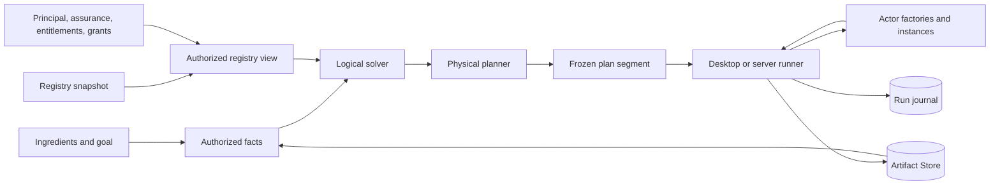
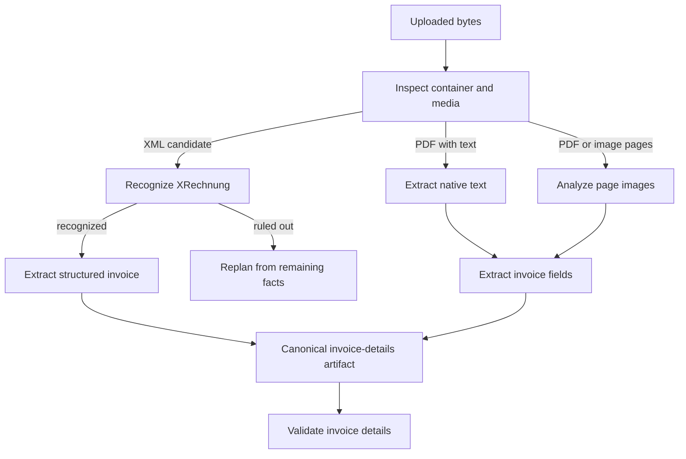
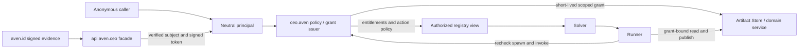
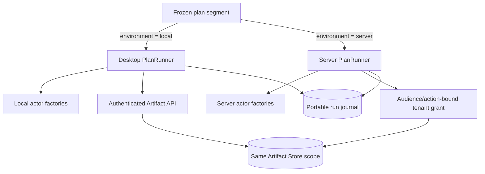

# Actors, skills, planning, and durable execution

Status: canonical conceptual architecture for the experimental actor runtime

Audience: contributors to avenOS, `api.aven.ceo`, desktop execution, and server
execution

Read [Skills: from an artifact or desired outcome to a resumable run](actor-skills-and-problem-solving.md)
first if the vocabulary is new. This paper explains why the pieces have their present
boundaries. The normative wire contracts, state machine, security boundary, and
cutover requirements are specified in
[Actor execution protocol and document-ingest cutover](actor-runtime-formal-spec.md).

This is a target architecture informed by working code, not a claim that the target
runner is complete. The current repository implements the qualified catalog, generic
registry, authorization contracts, logical and physical planners, portable run
values, document-specific desktop executor, authenticated server HTTP boundary, and
deterministic slices for generic execution, real-store publication, and durable secret
continuation. It does not yet implement the complete durable generic executor,
production factory composition, real product policy integration, encrypted-PDF actor/UI
integration, or XRechnung actors.

## The idea in one page

An actor is an independently addressable worker. It receives envelopes, keeps only
private working state, and describes the methods it can perform. A view is merely one
possible actor client; the same actor may run without a view in a desktop process, a
worker, or a server host.

A skill does not hard-code a sequence of actors. It names an outcome, its ingredients,
and its policy. The planner finds a program from the capabilities that are both
available **and authorized for the current principal**. The runner materializes that
program, commits immutable artifacts, and can stop at a durable boundary when it needs
new evidence or human input.

Five values must remain distinct:

1. an **actor definition** describes one versioned kind of actor;
2. a **capability** describes one invocable transformation or effect;
3. a **skill** describes a desired outcome and planning policy;
4. a **plan** freezes a principal-specific program and its placements; and
5. a **run** records attempts, artifacts, continuations, and completion.

The registry owns descriptions, factory offers, and live-instance advertisements. It
does not construct actors. Factories and execution hosts own construction and
teardown. The solver does not call actors or factories. The runner is the only part
that turns a plan into work.



The Artifact Store is shared durable truth no matter where execution happens. Actor
memory, a local mailbox, and a process address are never durable truth.

The default document interaction is artifact-first: the runner derives every relevant,
supported fact available from installed and authorized non-effecting capabilities,
then presents the actions enabled by those facts. An explicit exact goal prioritizes a
route through the same enrichment machinery. The target behavior is specified in
[Artifact-first semantic enrichment and affordance discovery](artifact-first-semantic-enrichment.md).
The current planner implements exact goals; exploratory saturation and affordance
discovery remain part of the target design.

## Begin with one document

Consider an uploaded invoice. At the beginning we know very little: there is a source
artifact and a media type claimed by the uploader. A file inspector can establish
whether the bytes are a PDF, XML document, image, or something unsupported. A
specialist recognizer can establish whether machine-readable XML is an XRechnung. A
visual analyzer can inspect a rendered page. Different extractors can nevertheless
publish the same canonical invoice schema. Those facts can then enable actions even
when the user supplied no exact goal.

No coordinator needs this decision tree in its source code. Each package contributes
facts and transformations. The runner executes only as far as the next fact it cannot
know in advance, commits the observation, and asks the planner again.



The arrows are not a stored workflow. They are one possible explanation generated
from current registry facts. Installing a better actor, changing authorization, or
learning that the file is structured data may produce a different program without a
new branch in a generic coordinator.

## Names say who owns a concept

Static catalog identities have the canonical form:

```text
authority:kind:namespace:name@version
```

The authority is an ownership boundary, not the hostname of the process that happens
to serve a request. First-party names use three deliberately separate authorities.

### `id.aven`: identity and authorization evidence

`id.aven` is the reverse-DNS form of `aven.id`. It is deliberately limited to:

- principal and workload identity identifiers;
- authentication and assurance evidence;
- identity-scoped authorization; and
- grants that can be verified across a trust boundary.

Examples:

```text
id.aven:assurance:authentication:passkey@1
id.aven:protocol:authorization:grant-evidence@1
```

`id.aven` does not own an actor, envelope, registry, factory, plan, run, checkpoint,
continuation, LLM, artifact, or product entitlement. The `aven.id` service answers who
authenticated and with what assurance; it does not decide which OCR model a
subscription may use.

### `os.aven`: neutral runtime vocabulary

`os.aven` owns contracts that describe how AvenOS executes work without depending on
one product domain:

- actor envelopes and addresses;
- registry snapshots and factory offers;
- plans, runs, attempts, checkpoints, leases, and continuations; and
- generic system actors such as a registry or human-input broker.

Examples:

```text
os.aven:protocol:actors:envelope@1
os.aven:protocol:actors:plan-runner@2
os.aven:protocol:actors:run-checkpoint@1
os.aven:actor:actors.system:human-input-broker@1
```

Runtime contracts can carry or reference `id.aven` evidence without becoming identity
contracts themselves. Likewise, a runner can execute a `ceo.aven` skill without
claiming ownership of that skill.

### `ceo.aven`: application, product, and domain vocabulary

`ceo.aven` is the reverse-DNS form of `aven.ceo`. It owns concepts whose meaning comes
from the avenCEO product and its data plane:

- document, bookkeeping, communication, and productivity actors;
- every LLM actor, model capability, prompt policy, and completion contract;
- skills, intents, and business capabilities;
- artifact schemas and fact vocabularies;
- subscription entitlements and configuration limits; and
- tenant, artifact, and domain-action policy names.

Examples:

```text
ceo.aven:actor:docs.ingest:document-inspector@1
ceo.aven:skill:docs.ingest:document-ingest@1
ceo.aven:capability:docs.ingest.xrechnung:extract@1
ceo.aven:schema:bookkeeping:invoice-details@2
ceo.aven:entitlement:product:vision-premium@1
ceo.aven:action:artifacts:read@1
ceo.aven:actor:ai.gateway:llm@1
```

A useful test is: is the concept proof about who authenticated or what was authorized?
Then it belongs to `id.aven`. Is it neutral machinery for executing work? Then it
belongs to `os.aven`. If its meaning depends on avenCEO artifacts, tenants, product
tiers, models, or workflows, it belongs to `ceo.aven`.

OpenAI compatibility is a transport property, not an identity boundary. All LLM
interaction belongs to `ceo.aven`; no model actor or invocation capability is owned by
`id.aven` or `os.aven`.

`kind` prevents an actor, capability, schema, protocol, action, entitlement, and policy
from colliding. `namespace` supplies the domain hierarchy. `name` is stable and
machine-facing. `version` identifies a contract, not a deployment. Display labels are
for people and may change.

Runtime actor instances use generated IDs because they are ephemeral. Their address is
separate and may name a local mailbox, worker, or HTTP endpoint. A frozen plan stores
qualified catalog IDs and serializable addresses or offers; it never stores an
in-memory actor reference.

Predicate functors are qualified by domain as well:

```prolog
ceo.aven.docs.document(D)
ceo.aven.docs.document_profile(D, xrechnung)
ceo.aven.bookkeeping.invoice_details(D)
```

Capability slots bind these logical facts to canonical schemas. An Artifact Store
adapter maps a schema such as
`ceo.aven:schema:bookkeeping:invoice-details@2` to the store’s concrete type key and
version. Planning code does not guess schema identity from a TypeScript type or an
envelope method name.

## What the registry contains

The generic registry has three catalogs. Keeping them separate avoids confusing “we
know this actor exists” with “this actor is currently running.”

### Definitions

An actor definition is a relatively stable, versioned contract. Its method
capabilities say which envelope method is invoked, what facts it requires, what it
guarantees, which schemas bind the inputs and outputs, its operation mode, retry
semantics, and logical cost.

```ts
interface CapabilitySlot {
  name: string
  predicate: string
  schema?: SchemaId
  role?: string
  cardinality: 'one' | 'optional' | 'many'
  sensitive?: boolean
}
```

`requires` and `produces` are the proof surface. Slots explain how a proven fact
becomes an envelope argument and how a returned value becomes a production-run output.
This removes document-specific role and ordinal switches from the runner.

A capability must distinguish:

- `transform`: deterministic or model-assisted data production;
- `observe`: produces a report whose outcome adds new planning facts;
- `effect`: changes an external system and needs explicit effect semantics;
- `stream`: produces transient events plus an eventual committed result; and
- `view`: projects state without becoming part of a dataflow proof.

### Factory offers

A factory offer is a serializable promise that an actor definition can potentially be
materialized. It identifies the factory, definition, capabilities, configuration
schema, default configuration, execution environment, trust domain, estimates, and
suggested lifetime.

An offer is neither permission nor a live actor. Several offers may implement the same
capability using different models, quality levels, costs, or placements. A desktop may
offer an on-device vision actor while a server host offers a stronger private model.

### Live instances

An instance advertisement says that a materialized actor can receive envelopes now.
It identifies the definition, address, capability subset, health, lease expiry,
placement, trust domain, and estimates. Draining instances finish assigned work but
receive no new placements.

Registry snapshots have a monotonically increasing revision and capture time. Plans
pin the snapshot they used. This makes a plan explainable and prevents the mutable
catalog from silently rewriting an active run.

The in-process `MessageBus` contributes its local actors to this same registry. It may
still own a local actor map for fast dispatch; that map is not a second conceptual
registry. Remote hosts publish the same transport-neutral definitions and offers.

## Authorization is a sequence, not a boolean

The split into `aven.id`, the `api.aven.ceo` facade, and downstream application/data
services gives the actor runtime a clean trust model:



Authentication answers who the principal is and what assurance was established. The
facade verifies that evidence, strips forged trust headers, selects a configured
downstream, and substitutes a service credential; it is not an open proxy or product
policy database. The application policy/grant component answers what that principal
may do. The Artifact Store and other data services enforce their own audience-,
action-, tenant-, scope-, resource-, routing-generation-, and expiry-bound grants.
Workload identity proves which service is calling; it does not substitute for user or
tenant authorization.

A neutral principal can represent anonymous, user, or service callers without baking
product tiers into identity:

```ts
interface Principal {
  subjectId: string
  kind: 'anonymous' | 'user' | 'service'
  assurance: string[]
  sessionId?: string
}
```

The effective actor set is the intersection of several independent decisions:

```text
catalog availability
∩ caller visibility
∩ product entitlement
∩ configuration policy
∩ artifact input grants
∩ execution-environment policy
∩ current assurance or exact-action approval
```

The solver sees only that authorized projection. It must never construct a beautiful
plan from forbidden actors and hope that execution rejects it later. Filtering first
also avoids revealing premium or sensitive capabilities through error explanations.

### Four actor enforcement moments

1. **Discover** decides whether a definition or capability may be revealed.
2. **Plan** decides whether an exact instance or factory offer, placement, and
   configuration may be considered.
3. **Spawn** makes an authoritative decision immediately before resources are
   allocated. The factory may normalize configuration or reduce the grant.
4. **Invoke** makes an authoritative decision immediately before an envelope is sent,
   bound to the principal, tenant, run, capability, actor, parameters, and inputs.

Planning decisions are deliberately advisory and short-lived. Spawn, invoke, artifact
read, and output publication are checked again to close time-of-check/time-of-use
gaps. Revocation or policy change may invalidate a placement and trigger replanning.
An effect that already happened follows its declared reconciliation or compensation
policy; it is never blindly retried.

### Authentication step-up, human approval, and human input differ

These three interactions may look similar in a UI but have different security
meaning:

| Interaction | Meaning | Durable representation |
| --- | --- | --- |
| Passkey or second-factor step-up | Establish stronger/recent identity assurance | Authentication evidence with expiry |
| Approve a dangerous mutation | Authorize one exact operation and payload | One-use, short-lived, digest-bound approval |
| Enter an encrypted-PDF password | Supply missing secret input to continue work | Request metadata only; secret remains ephemeral |

An approval must be bound to the capability, subject, tenant, run, input artifacts,
and a canonical digest of the parameters. “The user clicked approve once” is not a
reusable permission. Conversely, a PDF password does not authorize a payment or prove
identity; it is merely an input.

### Product tiers and configuration

Product entitlement is `ceo.aven` policy evaluated behind `api.aven.ceo` by the
runner's application authorizer or a dedicated grant service. It is not a claim owned
by `aven.id`, a coarse facade role, or an `if premium` in the solver. Policy evaluates
the exact candidate configuration. It may permit standard vision for twenty pages,
deny a high-accuracy model for that subscription, or force a lower page limit.

An allow decision may carry a decision ID, expiry, additional JSON Schema, forced
values, maximum uses, and obligations. Factory admission validates the normalized
configuration again and returns only the granted capabilities.

### Artifact access and future sharing

Permission to use an actor does not imply permission to read its inputs or publish its
outputs. `ArtifactResolver` turns an artifact into solver facts only after the caller
has an applicable read grant. Knowing an artifact ID never proves access.

This separation leaves room for future sharing. A user may grant another principal
read access to one file, contribute it to a shared tenant scope, or issue a narrowly
delegated capability. The planner need not learn the sharing mechanism. It receives
only authorized ingredients, while the runner presents the corresponding scoped grant
when it reads or publishes.

## Logical planning, physical planning, and discovery

Logical planning proves goals from facts using capability contracts. All requirements
of one capability are AND conditions. Multiple capabilities producing the same fact
are OR alternatives. The same capability may be applied repeatedly with different
variable bindings—for example, once for each page.

Physical planning chooses an authorized live instance or factory offer for every
logical step. It considers placement, locality, trust, cost, latency, configuration,
and policy. Keeping the two phases separate lets the proof remain stable while offers
come and go.

Some capabilities have guaranteed outputs. Others are observations: they guarantee a
typed report, but the report determines which additional facts become true. File
inspection, format recognition, model classification, human input, and external
queries all have this shape. Pretending their result is known during initial planning
would create a fictional DAG.

The runner therefore uses checkpointed, receding-horizon planning:

1. backward search finds routes to the goal and identifies unresolved guards;
2. the planner chooses a cheap authorized observer that can discriminate useful
   routes;
3. the runner executes to that discovery frontier;
4. it atomically publishes the observation report and projects validated facts;
5. it refreshes artifact grants, authorization, and registry state; and
6. it plans the unfinished goal again while preserving committed steps.

Each frozen segment and the evidence which caused the next segment are part of the run
record. Replanning extends provenance; it does not rewrite history.

Exploration uses the same mechanism with a different completion criterion. Instead of
stopping when one fixed proof closes, the initial exhaustive policy continues until no
eligible non-effecting invocation can add supported knowledge about the subject.
Relevance is constrained by the subject and allowed fact families; “learn as much as
possible” is never permission to invoke every installed Actor. The initial generic
slice computes this closure over declared guaranteed outputs; observation-dependent
fact projection still requires checkpointed replanning. Future bounded policies may
rank the frontier by a calibrated expected signal yield—the likely novel, useful,
schema-valid information for the current context—and stop at explicit cost, effort, or
privacy limits. Such a prediction orders or bounds work; it never establishes a fact.
The terminal understanding report records discovered artifacts, evidence, coverage,
unresolved questions, and the stopping reason.

## How XRechnung actually becomes automatic

“Install an XRechnung actor” is not enough. Something must establish that the input is
an XRechnung before an extractor requiring that fact can run. The practical extension
is a small capability family, not one magical parser.

### The recognition capability

The XRechnung package contributes a cheap recognizer. It accepts plausible
machine-readable candidates and always publishes a recognition report. The report has
validated outcomes such as `recognized`, `ruled_out`, `malformed`, or
`needs_clarification`. Only a recognized document projects:

```prolog
ceo.aven.docs.document_profile(D, xrechnung)
```

Recognition validates the relevant XML root, namespaces, profile identifiers, and
supported versions. It does not label every PDF “XRechnung.” If the intake inspector
finds an embedded structured payload supported by the application, that payload
becomes a candidate artifact of its own. A scan remains a page-image route.

### The extraction capability

The structured extractor requires both the source bytes and the recognized profile:

```prolog
requires:
  ceo.aven.docs.document(D)
  ceo.aven.docs.document_profile(D, xrechnung)

produces:
  ceo.aven.bookkeeping.invoice_details(D)

output schema:
  ceo.aven:schema:bookkeeping:invoice-details@2
```

The OCR/native-text route produces the same logical fact and schema. Downstream
validation, UI, queries, and bookkeeping skills cannot tell which route produced the
invoice unless they inspect provenance.

### Avoiding an indiscriminate probe storm

Recognizers advertise the media they accept, the predicate family they may observe,
their cost, and their possible outcomes. Backward search considers only recognizers
which can unlock a currently reachable route to the goal. It does not execute every
recognizer in the registry.

Adding XRechnung should require:

1. a recognizer and extractor actor package;
2. capability slots and fact projectors for their reports;
3. Artifact Store schemas and publication procedures;
4. local and/or server factory offers; and
5. contract, planner, and end-to-end examples.

It must not require an `if xrechnung` branch in a document coordinator or the generic
runner. The branch exists as data—the recognizer’s observation and the alternative
capability contracts—and is selected by replanning.

## Dynamic actor lifecycle

A physical step targets either a live instance or a factory offer. For a factory
target the runner:

1. resolves the factory implementation by qualified ID;
2. authorizes spawn for the principal, run, capabilities, inputs, placement, and exact
   configuration;
3. asks the factory to assess admission without allocating resources;
4. spawns the actor and receives an instance advertisement plus release handle;
5. advertises it in the registry and records it in the run placement table;
6. authorizes invocation, dispatches the envelope, validates the result, and commits
   outputs;
7. reuses or releases it according to its admitted lifetime; and
8. drains its mailbox, withdraws the advertisement, invokes the release handle, and
   disposes host resources.

Lifetimes may be `shared`, `session`, `run`, or `step`. The host may shorten a requested
lifetime. A factory owns teardown because only it knows how to stop its sandbox,
worker, container, model lease, or remote process correctly. The registry never calls
`dispose()` on its own.

Admission failure invalidates one placement, not necessarily the goal. The runner can
refresh the authorized view and choose an alternative. Spawn requests are idempotent
by request ID so an uncertain retry cannot create duplicate billable workers.

## One runner contract, two execution environments

The first placement decision is deliberately coarse: a run executes either on the
desktop or on the server. Hybrid execution and live migration are out of scope. Both
hosts implement the same serializable `PlanRunner` protocol and the same state
machine.



Registry offers advertise their execution environment. The physical planner filters
offers by the chosen environment and then optimizes within it. Local execution reads
and publishes through the authenticated API. Server execution uses short-lived,
audience- and action-bound tenant grants. Neither runner accepts a caller-selected
database, physical bucket, or tenant routing target.

Plans, run records, step attempts, continuation requests, and checkpoints contain no
in-memory references. A committed checkpoint identifies completed steps, immutable
artifacts, remaining goals, registry revision, policy decisions, and idempotency keys.
Actor-private memory may improve execution but cannot be required to recover it.

This gives a future environment handoff a clean seam: stop at a committed checkpoint,
release environment-local actors, authorize the new placement, and resume from the
same artifacts and journal. Migrating live actor memory or half-completed effects is
explicitly not promised.

## Encrypted PDFs are continuations, not failures

When inspection proves that a PDF is encrypted, the run has not failed. It has reached
an externally satisfiable input. The runner commits the inspection result and moves to
`waiting_for_input` with a typed request:

```ts
{
  kind: 'secret',
  schema: 'ceo.aven:schema:docs:pdf-password@1',
  subject: sourceArtifactId,
  prompt: 'Enter the password for this PDF',
  persistence: 'metadata-only'
}
```

Only request metadata is durable. The password must never enter an artifact,
production-run parameter, actor snapshot, log, telemetry event, registry fact, or
persisted intent. Submission creates a short-lived run- and step-scoped handle. A
secret broker injects the value into the decoder and destroys it after the attempt.

The expected behavior is precise:

- a correct password resumes from the committed inspection checkpoint;
- a wrong password leaves the request unresolved and allows another attempt;
- postponing suspends the run without marking it failed;
- reopening the intent re-presents the unresolved request;
- restarting re-presents it because the password was not persisted; and
- steering the conversation elsewhere neither resolves nor cancels it.

Cancellation is an explicit operation. Remembering a password would be a separate
credential-store feature with its own policy.

## Artifacts and runs divide durable truth

Artifacts are immutable domain values. A production-run receipt proves one committed
transformation from exact inputs to exact outputs. Mutable operational state belongs
in the run repository:

- pending, running, waiting, retry, and terminal step state;
- attempts, leases, and fencing tokens;
- registry revisions and authorization decision IDs;
- actor leases and physical placements;
- unresolved continuation metadata; and
- publication outbox and acknowledgement state.

An actor returning a value does not complete a step. Completion occurs only when its
validated artifacts and production-run receipt commit. A crash after actor execution
but before acknowledgement replays the same publication identity. Idempotency and
fencing prevent a crash from inventing a second derivation.

The Artifact Store is also the durable medium for meaningful agent-to-agent
communication. Agents publish domain artifacts, typed work requests, questions,
decisions, and results. Envelopes remain the low-latency control plane. Heartbeats,
leases, streaming tokens, retries, and delivery acknowledgements remain operational
run state rather than masquerading as domain artifacts.

## The generic runner is intentionally boring

`PlanRunner` depends on ports, not document classes:

- `RegistryReader` for versioned snapshots;
- `ActorAuthorizer` for discovery, planning, spawn, and invocation;
- `ActorFactoryResolver` for dynamic activation;
- `EnvelopeDispatcher` for local or remote delivery;
- `RunRepository` for plans, attempts, leases, fencing, and checkpoints;
- `ArtifactResolver` for authorized capability-slot bindings;
- `ArtifactPublisher` for atomic outputs and receipts;
- `FactProjector` for validated facts from committed outputs;
- `ContinuationStore` and `SecretBroker` for human input; and
- clock, retry, approval, effect, and placement policy ports.

It owns readiness, activation, reauthorization, binding, dispatch, validation,
publication, suspension, replanning, and teardown. It knows nothing about PDFs,
invoices, OCR, XRechnung, prompts, or document presentation. Domain packages own those
capabilities, schemas, fact projections, and optional recipe hints.

The current `DocumentProcessingRuntime` remains a useful application executor. It is
not the general runtime, and its document-shaped branches must not leak into the
generic contract. Device placement executes in the desktop process. Server placement
submits the portable run command through the facade and executes the same document
runtime in `services/actor-runner`, using a headless decoder and tenant-scoped Artifact
Store publisher.

Separately, `services/actor-runner` implements the authenticated remote HTTP boundary
behind `api.aven.ceo`. It independently verifies forwarded identity evidence and
tenant grants, then stores run records in the selected customer's PostgreSQL database.
After a process restart it reclaims accepted rows when that customer's worker pool is
next admitted. Its deployed composition routes registered application skills through
an application executor catalog and everything else through the portable
registry/planner/factory executor with empty fail-closed ports. The first production
application entry is document ingestion. It fetches only the admitted source artifact
from the selected tenant scope and publishes every derived result with a dedicated
runner service identity. Deterministic tests populate the generic ports with a dynamic
factory, while document conformance tests compare the real browser and headless
application executors. A concrete generic Artifact Store port separately proves
trusted fact projection and atomic production-run publication.

## Documentation is part of the contract

A dynamic system becomes unmaintainable if its registry is better documented in
people’s memory than in the repository. Clean documentation is therefore a delivery
requirement, not a cleanup task.

Every actor package should contain a concise README covering:

- purpose, non-goals, owner, and lifecycle;
- qualified actor and capability IDs;
- input/output slots, schemas, and projected facts;
- operation, retry, effect, privacy, and placement semantics;
- authorization and assurance requirements;
- supported configuration and entitlement boundaries;
- continuation and failure behavior; and
- a minimal executable example and contract tests.

The manifest and schema contracts are the source of truth for machine-readable
inventories. Actor and capability catalogs should be generated from them rather than
maintained twice by hand. CI should validate unique qualified IDs, allowed authorities
and kinds, schema references, examples, links, and generated catalog freshness. A
contract-version change must update its tests and documentation in the same pull
request.

Architecture papers explain decisions and end-to-end behavior; package READMEs explain
how to use one package; generated catalogs answer what exists now. Keeping those jobs
separate makes the documentation both pleasant to read and cheap to maintain.

## Delivery path

The work now has a stable foundation and a deliberately unfinished execution core:

1. **Catalog and planning foundation — implemented.** Qualified identities,
   method-level capabilities, schema slots, definitions, live advertisements, factory
   offers, principal-scoped planning views, and environment-specific physical plans
   exist in `@avenos/actors`. Observation-frontier execution is designed but not yet
   implemented.
2. **Portable and persistent remote boundary — implemented as a baseline.** The run
   protocol is strict JSON. The app exposes Device/Server placement, and
   `services/actor-runner` proves authenticated routing, independent token verification,
   subject isolation, customer-database isolation, durable start idempotency, status,
   cancellation, and recovery of accepted rows after restart. Its conformance
   composition executes a generic factory actor and commits output lineage through the
   real Artifact Store. The deployed service uses that composition as its fail-closed
   generic fallback and registers document ingestion in its application catalog. The
   app's Server placement calls it through the facade.
3. **Policy integration — next.** Connect the authorization contracts to avenCEO
   entitlements, assurance, artifact grants, configuration constraints, and exact
   spawn/invoke decisions. The current authorizer is only a contract and test seam.
4. **Generic durable executor — in progress.** Slot resolution, trusted fact projection,
   dynamic factory execution, atomic Artifact Store publication, checkpoint evidence,
   and a metadata-only secret continuation have executable slices. Attempts, leases,
   fencing, a publication outbox, secret-handle integration, and checkpointed replanning
   remain.
5. **Dynamic activation — next.** Replace eager document singletons with authorized
   desktop and server factory offers while keeping fixture parity with the working
   document coordinator.
6. **Remote document cutover — implemented for deterministic inputs.** The app's Server
   choice uses the authenticated runner and a dedicated Artifact Store service identity.
   Text, CSV, and native-text PDF parity is release-tested. Server OCR and model-backed
   understanding remain follow-up application capabilities.
7. **XRechnung and encrypted-PDF proofs — after the executor.** Add recognizer and
   extractor without changing the runner; add secret continuation behavior without
   persisting the password.
8. **Documentation gates — ongoing.** Generate actor and schema catalogs, validate
   examples and links, and fail CI when contracts, tests, and documentation drift.

Success is not merely that one invoice imports. Success is that a new capability can
enter the registry, be hidden or admitted by policy, be placed locally or on the
server, discover what it needs to discover, publish the same durable schemas, suspend
for a human without losing its place, and leave the generic runner unchanged.
