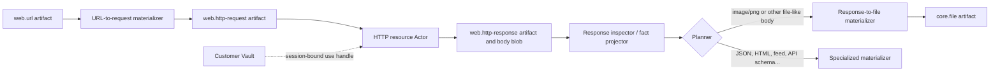

# HTTP resource actors and credential routing

Status: target architecture with request, Vault-matching, ETag, and live-session foundations implemented

## Purpose

An Aven should be able to use a URL as working material without teaching every
document, image, data, or planning Actor how to speak HTTP. A URL can become an
immutable HTTP request, one Actor can execute that request, and the exact response can
become an immutable artifact. Other Actors can then turn the response into an ordinary
file, text, JSON, an image, or a domain-specific value.

Authentication is the difficult boundary. A request artifact must be safe to retain,
inspect, and reuse, so it cannot contain an API key, cookie, bearer token, password, or
signed URL assembled from a secret. A new customer-scoped Vault service selects and
uses credentials immediately before the request, under a URL-scoped policy, and never
publishes or returns the secret.

This paper specifies that boundary. It extends the Actor, planner, and Artifact Store
model described in [Actors, skills, planning, and durable
execution](generic-actor-registry-and-runtime.md) and the exploratory flow in
[Artifact-first semantic enrichment and affordance
discovery](artifact-first-semantic-enrichment.md). It is not a description of current
HTTP-fetch behavior: the types, Actors, Vault component, and streaming runtime ports
below are being implemented incrementally. `@avenos/http-resources` now owns the strict
request contract, session-scoped Vault interfaces and matcher, private response-index
port, redirect-aware acquisition core, and conditional-request behavior. Actor Runner
also passes live identity proof to only the active execution attempt without retaining
it. The customer-database Vault component, Artifact Store blob publication, HTTP Actor
factory registration, response classification, and file materialization remain
unimplemented.

The current protocol-version-2 runtime slice can expand the guaranteed outputs of
authorized non-effecting capabilities and produce an understanding bundle plus
available affordances. It cannot yet checkpoint and replan from an observation's
contents. HTTP classification depends on that next slice: the planner cannot know that
a response is `image/png` until the response or its inspection has committed.

## The proposed flow

The smallest useful path has three independently discoverable transformations:



Here **artifact materializer** means an Actor that turns one durable representation
into another, such as HTTP response to `core.file`. It is distinct from an
`ActorFactory` materializing a live Actor instance and from a workspace adapter
materializing an artifact as a temporary path.

The HTTP resource Actor performs one exchange. It does not crawl links, load HTML
subresources, execute JavaScript, submit forms, parse the response into a domain value,
or write a workspace file. Those are separate capabilities with their own artifacts,
limits, and authority.

Artifact-first enrichment does not turn every discovered hyperlink into network work.
Only a URL admitted as the run's source, or a URL selected through a fetch affordance,
projects `ceo.aven.web.source_url(U)`. Links extracted from HTML or documents project
`ceo.aven.web.discovered_url(U)` and remain inert until selected. This bounds eager
enrichment and keeps untrusted content from causing recursive fetches.

Both local and server execution use the normal Actor runtime. Placement is frozen in
the admitted run as it is for document Actors. The definitions and schemas are shared;
the local and server hosts provide different HTTP transports, egress policy, and
Artifact Store access. Durable credentials have one authority: the Vault component in
the selected customer database.

## Durable artifact vocabulary

The names below are concrete version-1 proposals. Each qualified schema ID maps to the
corresponding Artifact Store type through an application schema binding, as document
schemas do today.

| Artifact type | Blob | Meaning |
| --- | --- | --- |
| `web.url@1` | none | A normalized public URL plus its source kind; only an admitted source or selected link becomes fetchable |
| `web.http-request@1` | none in version 1 | A retained request for one `GET` or `HEAD`, with public headers and authentication intent but no credentials |
| `web.http-response@1` | required, including a zero-byte blob | One effective HTTP response after validator/cache resolution; the blob is the reusable representation body |
| `web.http-response-inspection@1` | none | A versioned assessment of declared and detected media, filename, safety, and materialization choices |
| `core.file@1` | required | An ordinary file occurrence derived from a response and usable by existing Actors |

`web.url@1` is useful when the source has not yet committed to HTTP method, accepted
media, authentication, freshness, or redirect behavior. A deterministic materializer
turns a `source_url` into `web.http-request@1`. A skill or selected affordance may also
create the request directly. Merely extracting a URL does not establish `source_url`.

### HTTP request

A version-1 request is deliberately a resource read, not a general-purpose network
effect:

```json
{
  "method": "GET",
  "url": "https://api.example.com/reports/2026-08",
  "headers": [
    { "name": "accept", "value": "application/pdf,image/*;q=0.8" }
  ],
  "authentication": {
    "mode": "mapped-required",
    "purpose": "report-read"
  },
  "redirects": { "mode": "follow", "maximumHops": 5 },
  "freshness": "revalidate"
}
```

The schema admits only `GET` and `HEAD`. It stores normalized `https` URLs by default,
bounded non-secret request headers, and explicit policies. It rejects URL user-info and
caller-provided `authorization`, `cookie`, `proxy-authorization`, `host`, forwarding,
connection, content-length, `if-none-match`, and `if-modified-since` headers. The
executor owns conditional headers so the retained request and selected prior artifact
remain accountable. A local-development policy may admit `http` for named origins; an
artifact cannot grant that exception to itself.

Query parameters in the artifact are public request data. A bearer token, API key,
signature, session identifier, or presigned-URL parameter belongs in the credential
store and is injected at execution. Version 1 rejects URL user-info and known
secret-bearing query profiles, but key-name scanning cannot prove that arbitrary text
is non-secret. Trusted request-creation adapters, not the Artifact Store kernel, own
this boundary; opaque presigned URLs are unsupported until a provider profile can
separate their public target from credential material.

Authentication has three modes:

| Mode | Behavior |
| --- | --- |
| `anonymous` | Never attach a credential, even if a binding matches. This is the default. |
| `mapped-required` | Require exactly one authorized credential binding for the normalized request and purpose. |
| `mapped-if-present` | Use a unique authorized binding when present; otherwise remain anonymous. Policy must explicitly allow this mode because it can change server behavior. |

Version 1 has no request body. `POST`, `PUT`, `PATCH`, `DELETE`, WebDAV, GraphQL
mutation, and similar operations belong to later effect-specific Actors. They need
request/receipt artifacts, exact-action approval where applicable, idempotency keys,
and reconciliation of an ambiguous outcome. Calling a generic shell or HTTP client and
recording its exit code is not an effect receipt.

### HTTP response

Every exchange that receives a final response produces `web.http-response@1`, including
redirect-terminal `3xx`, `4xx`, and `5xx` statuses. HTTP status is observed data, not an
Actor failure. A conditional `304 Not Modified` is the exception at the wire boundary:
it validates a previously committed representation and therefore produces an effective
response whose body reuses that prior artifact's blob. DNS, connection, TLS,
credential, policy, timeout, decompression, and size failures produce no HTTP response;
the run records a bounded typed failure and may apply its admitted retry policy.

A response payload contains bounded transport metadata:

```json
{
  "requestedUrl": "https://api.example.com/reports/2026-08",
  "finalUrl": "https://cdn.example.com/reports/2026-08.pdf",
  "statusCode": 200,
  "networkStatusCode": 304,
  "cacheDisposition": "revalidated",
  "representationSourceArtifactId": "prior-response-artifact-id",
  "protocol": "h2",
  "declaredMediaType": "application/pdf",
  "declaredCharset": null,
  "etag": "\"42d-aven\"",
  "headers": [
    { "name": "etag", "values": ["\"42d-aven\""] },
    { "name": "content-disposition", "values": ["attachment; filename=report.pdf"] }
  ],
  "redirectCount": 1,
  "storedBodyLength": 285141,
  "capturedAt": "2026-08-30T10:00:00.000Z"
}
```

`statusCode` is the effective representation status exposed to downstream Actors;
`networkStatusCode` records a different conditional status when applicable. A new
download normally has the same value in both fields and may omit
`networkStatusCode`. `cacheDisposition` is `new`, `fresh-cache`, or `revalidated`.

The primary blob contains the complete stored representation body. The executor
removes HTTP transfer framing and decodes only explicitly supported content encodings
before publication, so an image materializer receives image bytes rather than a gzip
stream. The production receipt records the received encoding and decoder
implementation. A newly downloaded response is not published when the body is
partial, exceeds a limit, fails decoding, or disagrees with the byte count enforced by
the transport. A revalidated response instead attaches the already committed blob by
artifact ID and digest; it never fabricates bytes for the empty `304` wire body.

The payload retains a small allowlist of useful headers. It never retains
`set-cookie`, authentication challenges containing sensitive parameters, proxy
headers, or credential-injected query values. Redirect locations and effective URLs
are sanitized before retention. The production run already binds the exact request
artifact as input, so the response does not duplicate provenance in an unvalidated
payload field.

The server-provided `Content-Type` is a declared media type, not detected truth. The
response inspection Actor may sniff bounded leading bytes and publish a separate
versioned assessment. It does not rewrite the response, just as file inspection does
not rewrite `core.file.declaredMediaType`.

## Existing-artifact lookup and ETag revalidation

Before opening a network connection, the execution host checks an authorized response
index for an existing `web.http-response@1` artifact. Lookup is not a global search by
URL or ETag. Its private cache partition includes:

- customer environment, scope, and principal or service subject;
- anonymous access or the stable Vault credential reference;
- normalized method and URL after removing credential-injected fields;
- the values of representation-selecting request headers; and
- the prior response's `Vary` field names and corresponding request values.

An ETag is an opaque validator and is meaningful only inside that partition and cache
key. It is retained exactly, including the `W/` marker for a weak validator. `Vary: *`
makes a response ineligible for automatic reuse. `Cache-Control: no-store` prevents it
from entering the reusable response index even when product policy separately permits
the explicitly requested response artifact to be retained. `private` never broadens
the credential/principal partition, and avenOS does not share cached authenticated
responses across customers merely because an origin marks them `public`.

The default `freshness: revalidate` procedure is:

1. Normalize and authorize the request, resolve any credential binding, and calculate
   the private cache key.
2. Find the newest readable, complete prior response whose key and `Vary` values match.
3. If policy and HTTP freshness metadata say that artifact is still fresh, return that
   existing artifact and record a `fresh-cache` selection without network I/O.
4. Otherwise, when it has an ETag, inject `If-None-Match` with that exact validator.
   `Last-Modified`/`If-Modified-Since` is a fallback only when no ETag exists.
5. On `304 Not Modified`, validate the response against the selected candidate, merge
   permitted metadata according to HTTP cache rules, and publish a new effective
   response occurrence that reuses the candidate's blob and records both artifact ID
   and digest. Its production receipt records the actual `304` exchange and zero body
   transfer.
6. On a body-bearing response, stage and publish the new bytes. Artifact Store content
   addressing deduplicates an identical blob, while the response occurrence still
   records the new observation.

`fresh-cache` may return the existing response artifact directly because no new remote
observation occurred. `revalidated` creates a new response occurrence because the
`304` is new evidence about freshness, even though both occurrences share the same
physical blob. The runner must add existing-output selection and existing-blob reuse to
its publication contract rather than downloading or base64-copying the old content.

These rules follow the conditional request and cache-key semantics of
[HTTP Semantics](https://www.rfc-editor.org/rfc/rfc9110.html#section-13.1.2) and
[HTTP Caching](https://www.rfc-editor.org/rfc/rfc9111.html#section-4.1). The Artifact
Store remains the durable authority for which exact prior body and digest were reused.

## Streaming bytes without breaking portability

Plans, checkpoints, and envelopes are portable JSON. They cannot contain a
`ReadableStream`, `AsyncIterable<Uint8Array>`, Node buffer, open file, socket, or
Artifact Store upload authority. The current generic Artifact Store runtime port also
publishes JSON-only output drafts. HTTP acquisition therefore needs two host-owned
streaming ports:

```ts
interface ArtifactBlobReader {
  open(artifactId: string, grant: ArtifactReadGrant): Promise<ReadableStream<Uint8Array>>
}

interface ArtifactBlobStager {
  stage(
    publicationId: string,
    source: ReadableStream<Uint8Array>,
    limits: BlobLimits
  ): Promise<AttemptScopedStagedBlobHandle>
}
```

The HTTP transport yields metadata and a one-shot body stream. The host stages that
stream while enforcing byte, time, and decompression bounds. The Actor result contains
only a host-issued attempt-scoped handle. `ArtifactPublisher` consumes the handle and
atomically publishes the response artifact and production-run receipt. Neither the
handle nor any bytes enter a run record.

Downstream Actors receive the response artifact ID through their normal input slot.
When a capability needs the body, its host adapter opens an authorized byte stream
through `ArtifactBlobReader`. This is the sense in which an HTTP response is available
as a byte stream: the immutable artifact owns the bytes, while each invocation gets a
fresh, bounded stream. It is not a base64 field in the response payload.

Staging also defines the crash boundary. A retry of the same publication ID reuses the
same completed staged blob. If the process dies before staging completes, no response
artifact exists and a later `GET` may observe a newer representation. The run receipt
must not pretend that the abandoned response was committed.

## Classification and materialization

The planner should not switch on a MIME string inside a coordinator. Schema projectors
and observation Actors expose qualified facts from committed artifacts, for example:

```prolog
ceo.aven.web.source_url(U)
ceo.aven.web.http_request_anonymous(Q)
ceo.aven.web.http_request_mapped(Q)
ceo.aven.web.http_response(Q, R)
ceo.aven.web.declared_media(R, image_png)
ceo.aven.web.detected_media(R, image_png)
ceo.aven.web.materializable_file(R)
ceo.aven.docs.file(F)
```

Predicate constants use catalog-safe names such as `image_png`; the artifact retains
the IANA media string `image/png`. A projector may expose the declared-media fact
directly from a schema-validated response. A byte-sniffing inspector emits
`web.http-response-inspection@1`; only its validated output projects detected-media and
safety facts. If declared and detected media disagree, policy or a specialized Actor
decides what may proceed.

The corresponding `http-response-classifier` is an `observe` Actor: it always publishes
the inspection artifact, even when its outcome is `unknown`, `mismatch`, or
`unsupported`. A result projector, rather than the classifier's coordinator, exposes
the exact facts that make a downstream materializer applicable.

The first materializers should be ordinary Actor capabilities:

| Capability | Requires | Produces |
| --- | --- | --- |
| URL to HTTP request | `ceo.aven.web.source_url(U)` | one request predicate selected by its authentication mode |
| Anonymous fetch | `ceo.aven.web.http_request_anonymous(Q)` | a committed response observation |
| Authenticated fetch | `ceo.aven.web.http_request_mapped(Q)` plus an authorized server/Vault route | a committed response observation |
| Response to file | safe file-like response | `ceo.aven.docs.file(F)` |
| JSON response decode | detected JSON response | a typed JSON-value artifact |
| HTML response decode | detected HTML response | text/DOM/link artifacts |

The response-to-file Actor publishes a new `core.file@1` occurrence whose blob contains
the response bytes, `declaredMediaType` comes from the accepted media decision, the
filename is a sanitized `Content-Disposition` name or URL-path fallback, and
`sourceKind` is `web-response`. The production run names the response artifact as its
input. Artifact Store content addressing may reuse the physical blob, but the response
and file remain distinct semantic occurrences.

A generic response-to-file Actor can accept any admitted file-like response. More
specific materializers can require `detected_media(R, image_png)`, JSON, HTML, PDF, or
a domain schema. They compete normally on cost and goal usefulness. After `core.file`
is committed, existing document and image Actors can use it without knowing that its
bytes came from HTTP.

Response inspection is a discovery frontier. The runner commits the inspection,
projects its validated facts, and replans the unfinished suffix. It does not predict a
server's content type or execute every installed decoder speculatively.

For an exploratory URL run, `goalSpec.factFamilies` admits only the web facts and the
downstream families the skill intends to enrich, for example `ceo.aven.web` and
`ceo.aven.docs`. The exhaustive planner may run URL-to-request and fetch because the
subject is a source URL. After response inspection, checkpointed replanning can add the
matching file, JSON, or HTML materializer. This is a target extension of the current
static guaranteed-output closure, not behavior already implemented by the initial
enrichment slice.

## Customer Vault and discoverable bindings

Credential material is neither an artifact nor Actor state. Every durable credential
belongs to the new `ceo.aven:component:data:vault@1` component in the selected customer
database. There is no second credential copy in the Actor Runner, application database,
Artifact Store, desktop settings, or operating-system keychain.

The Vault component owns an `aven_vault` schema installed through the standard customer
component manifest, migrations, function roles, routing generation, isolation tests,
backup, and recovery path. Version 1 stores the secret value directly in that customer
database. Physical database isolation, schema roles, the Vault service boundary, and
session authorization are the initial protection; this is not an encryption-at-rest or
end-to-end encryption claim.

Vault has two durable records:

1. a **credential** contains one secret value plus a stable reference and version; and
2. a **binding** matches normalized requests and declares exactly how to attach that
   credential.

The storage adapter owns the secret column. A later migration can replace the stored
value with an encrypted envelope and key version without changing request artifacts,
bindings, Actor contracts, or the session-scoped Vault API. Replacing a credential with
one for a different remote account creates a new credential reference; ordinary
rotation for the same account retains it. That reference is also the private HTTP cache
partition.

### Set-only public API

Secret material enters Vault only through authenticated environment-scoped routes on
`api.aven.ceo`. The public surface supports create/set, rotate, revoke, and binding
management. A successful set or rotation returns only a stable credential reference,
redacted metadata, version, and timestamps.

```text
client -- set / rotate / revoke --> api.aven.ceo --> Vault --> selected customer database
                                                  ^
Actor Runner -- match / resolve for use ------- session-bound internal call
```

The component exposes distinct actions and database functions:

| Action | Caller | Result |
| --- | --- | --- |
| `vault:metadata` | Authenticated facade | Redacted credential and binding descriptors |
| `vault:set` | Authenticated facade only | Create or replace a secret value; return metadata only |
| `vault:revoke` | Authenticated facade only | Revoke a credential or binding; return metadata only |
| `vault:match` | Actor host with user-session evidence | `none`, `ambiguous`, or one redacted binding and credential reference |
| `vault:use` | Actor host with user-session evidence | One request-scoped credential attachment for the trusted HTTP transport |

There is deliberately no `vault:read` action. Separate customer-qualified runtime
roles back metadata, set/revoke, and use operations; none is a schema owner or can
access another component. Only the use function can select the secret column, and only
while resolving one admitted request under an active session.

There is no public or metadata API to get, reveal, export, echo, test-return, or list a
secret value. The session-scoped `vault:use` function is the only read path. A metadata
list may return labels, schemes, binding patterns, enabled/revoked state, and last-use
time, but never the stored value, applied headers, cookies, query values, signing
inputs, refresh tokens, or client keys. Error responses and audit records follow the
same rule.

The facade verifies the current `aven.id` session, customer environment, entitlement,
and exact Vault action. It strips forged trust headers, selects the customer route, and
issues a tenant grant addressed to Vault. Only the facade's fixed workload identity may
call Vault's set/rotate/revoke ingress. Neither Actor Runner nor an Actor receives a
database role or endpoint that can write arbitrary Vault rows.

### Session-bound internal use

Actors interface with Vault through a host port. The Actor and its portable envelope
never receive a secret value; the trusted server HTTP transport may receive one
request-scoped attachment in process memory. An authorized caller may discover
redacted descriptors such as “Acme reports API, Authorization header.” The planner
only learns whether a usable binding exists. Immediately before I/O, the Actor host
resolves the attachment under the original verified user subject and session plus a
Vault-audience tenant grant. A service credential by itself is insufficient.

A target port is:

```ts
interface SessionVaultClient {
  match(request: NormalizedHttpRequest, context: ActorAccessContext): Promise<
    | { outcome: 'none' }
    | { outcome: 'ambiguous'; bindingRefs: string[] }
    | { outcome: 'matched'; binding: RedactedCredentialBinding; credentialRef: string }
  >

  resolveForUse(input: {
    bindingRef: string
    requestDigest: string
    runId: string
    stepId: string
    sessionId: string
  }): Promise<RequestScopedCredentialAttachment>
}
```

`RequestScopedCredentialAttachment` is a host-only value containing the binding's
typed attachment rule and resolved secret. It is valid only for the exact request
digest and attempt. The HTTP host applies it after request validation, then discards it.
It never enters an Actor payload, artifact, run record, checkpoint, receipt, error, or
log.

If stronger process isolation is needed later, the attachment can become an opaque
handle consumed by a co-located transport adapter. That changes the Vault host port,
not the durable schema, binding language, request artifact, or Actor capability.

Resolution expires no later than the user's session, tenant grant, or invocation. A
durable run cannot resolve another credential after the session expires; it pauses and
requires a new authenticated session. A response artifact remains ordinary customer
data after publication, but its provenance does not become authority to use the
credential again.

Because the secret never leaves the server trust boundary, version 1 advertises
authenticated fetch only as a server placement. Anonymous fetch may have local and
server offers. This keeps Vault a storage and resolution service rather than turning it
into an HTTP proxy.

### Binding shape and matching

A binding uses structured match fields rather than a free-form regular expression:

```json
{
  "bindingRef": "credential-binding-id",
  "label": "Acme reports API",
  "credentialRef": "credential-id",
  "placements": ["server"],
  "schemes": ["https"],
  "host": { "kind": "exact", "value": "api.example.com" },
  "ports": [443],
  "pathPrefix": "/reports/",
  "methods": ["GET", "HEAD"],
  "purpose": "report-read",
  "attachment": {
    "kind": "header",
    "name": "authorization",
    "prefix": "Bearer "
  },
  "enabled": true
}
```

Version 1 uses a small discriminated union rather than executable templates:

| Attachment | Mapping fields | Applied request value |
| --- | --- | --- |
| Header | `kind: header`, header `name`, optional `prefix` | One header whose value is `prefix + secret` |
| Cookie | `kind: cookie`, cookie `name` | One cookie value for the matched origin/path |
| Query | `kind: query`, parameter `name` | One percent-encoded query value |

This covers bearer/API-key headers, static session cookies, and query API keys. Names
and prefixes are length-bounded, contain no control characters, and pass transport
allowlists. A binding cannot set `host`, framing, forwarding, proxy, conditional, or
other hop-by-hop fields. Supporting Basic authentication, request signatures, OAuth
refresh, client certificates, or multi-value credentials later adds another typed
attachment kind; it does not add arbitrary code or string interpolation to a binding.

`methods` is a required, non-empty part of the binding match. Vault compares the
request artifact's normalized HTTP method exactly before resolving the attachment and
never changes that method. Separate bindings may therefore use different credentials
or attachment rules for `GET`, `HEAD`, and future effect-specific methods on the same
origin and path.

Host suffix bindings, when enabled by policy, match DNS label boundaries: a rule for
`*.example.com` matches `a.example.com`, not `example.com.evil.test`. Paths match
segment boundaries after URL normalization. Query values and fragments do not select
a credential. Exact host outranks a suffix, the longest path outranks a shorter path,
and method plus purpose narrow the result. Two equally specific authorized matches are
an error; Vault never picks by storage order.

The mapping itself is sensitive account metadata. Listing and matching are scoped to
the principal, customer environment, active session, execution placement, and policy.
A stable binding and credential reference may survive rotation for the same remote
account; rebinding to a different account requires a new credential reference.
Production receipts may retain the binding reference, credential reference, attachment
kind, policy decision ID, and secret version identifier; they never retain the secret
or applied header, cookie, or query value.

Version 1 stores static values only. OAuth refresh, mutable cookie jars, request-signing
clocks, and client-key operations remain later typed attachment kinds with their own
lifecycle tests. `Set-Cookie` never becomes planner-visible content or silently mutates
a static credential.

If `mapped-required` finds no binding during a directed acquisition, the run waits
with metadata describing the origin, purpose, scheme requirements, and placement. In
exploratory enrichment, other eligible work may continue; the understanding result
records the unavailable authenticated route and affordance discovery may present a
“connect credentials” action under **Could become available**. The current affordance
implementation returns only executable actions, so blocked external-connection
affordances are another explicit runtime extension.

A one-attempt secret may travel through the existing metadata-only secret continuation
only when policy explicitly allows non-persistent use. Saving it requires the separate
set-only Vault API action; the Actor cannot convert a continuation value into a stored
credential. Resuming the run then performs session and binding authorization again. A
secret submitted to a continuation must not be smuggled into an artifact to make it
reusable.

## Network and credential safety

An authenticated HTTP Actor is also an SSRF and credential-exfiltration boundary. The
trusted host must enforce all of these rules independently of artifact contents:

- permit only admitted schemes, origins, ports, methods, and request-header names;
- reject URL user-info and secret-looking caller headers;
- resolve DNS through the host policy, block loopback, link-local, private,
  carrier-grade NAT, multicast, and cloud-metadata destinations unless an exact local
  policy grants them, and defend against DNS rebinding;
- apply connection, header, body, decompression-ratio, total-time, and redirect limits;
- validate TLS names and chains and refuse silent HTTPS-to-HTTP downgrade;
- reconsider egress policy and Vault matching at every redirect;
- never forward a credential across an origin change unless the new origin independently
  matches the same credential policy;
- keep injected headers, signed query values, cookies, response cookies, and secret
  challenge fields out of artifacts, logs, errors, traces, and model prompts; and
- authorize artifact read, credential use, network egress, and response publication as
  separate decisions.

Vault binding availability is not permission to use a credential. A plan-time match is
advisory. Spawn and invoke authorization bind the principal, customer environment,
run, capability, request artifact, normalized URL, method, purpose, placement, and
request digest. Vault then resolves one request-scoped attachment. Revocation or
session expiry between planning and invocation fails closed and may trigger replanning
or a continuation.

## Retry, freshness, and identity

A request artifact describes what may be fetched; the authorized response index decides
whether an existing artifact satisfies it. `freshness: revalidate` is the version-1
default. `offline-only` requires a matching stored artifact and performs no network
I/O. `new-capture` explicitly bypasses freshness and validators, but Artifact Store
still deduplicates identical physical bytes. Policy may forbid that bypass for costly
or sensitive origins.

Retries within one step reuse the step's stable publication identity. A completed
staged body and publication acknowledgment replay without another network request.
Before response headers are received, `GET` and `HEAD` may be retried under the admitted
policy. After an ambiguous transport failure, another `GET` is a new observation and
the attempt journal must say so. The runner must not claim exactly-once observation of
a mutable remote resource.

The selected prior response ID, its digest, ETag, cache partition, `Vary` match, request
identity, freshness decision, and actual network status belong in the bounded
production receipt. Credential values and injected conditional/authentication headers
do not. A lookup result is advisory until artifact access, cache eligibility,
credential reference, and digest are rechecked at publication.

## Actor contracts

The request schema projector emits one mode-specific predicate from the same committed
request artifact. This lets the catalog expose separate anonymous and authenticated
capabilities without inventing a credential artifact. A sketch of the authenticated
method is:

```ts
{
  name: 'http_fetch_authenticated',
  mode: 'observe',
  idempotency: 'reconcilable',
  requires: ['ceo.aven.web.http_request_mapped(Q)'],
  produces: ['ceo.aven.web.http_response(Q, R)'],
  inputSlots: [{
    name: 'request',
    predicate: 'ceo.aven.web.http_request_mapped(Q)',
    schema: 'ceo.aven:schema:web:http-request@1',
    role: 'request',
    cardinality: 'one'
  }],
  outputSlots: [{
    name: 'response',
    predicate: 'ceo.aven.web.http_response(Q, R)',
    schema: 'ceo.aven:schema:web:http-response@1',
    role: 'response',
    cardinality: 'one'
  }]
}
```

Vault satisfiability belongs to physical planning, factory admission, and invoke
authorization, not the logical fact graph. When the request artifact already exists,
an authorized registry view can omit a server placement with no matching Vault
binding. When a prior step produces the request, the runner commits it and replans
before choosing the fetch placement. In both cases Vault repeats matching immediately
before I/O.

The current generic executor does not yet pass exact bound input artifact IDs and
digests into spawn and invoke authorization. HTTP acquisition requires that extension;
authorization cannot safely select a credential from only the Actor definition and
run-level resource metadata.

The capability is an observation because it reads mutable external state. Its
`reconcilable` label does not make the remote resource immutable; it means the runtime
has a defined staged-body and publication replay procedure. A future mutating HTTP
capability must use `mode: effect` and a different contract.

## Implementation slices

The design can land without a document-specific coordinator:

1. Register `web.url@1`, `web.http-request@1`, `web.http-response@1`, and response
   inspection schemas and their canonical `ceo.aven:schema:web:*@1` bindings.
2. Extend the generic Artifact Store resolver/publisher with bounded host-owned blob
   reading and staging, existing-response lookup, existing-output selection, and
   existing-blob reuse. Prove that no byte stream or staging authority enters portable
   run state.
3. Add URL-to-request, anonymous conditional `GET`/`HEAD`, response inspection, and
   response-to-`core.file` Actors plus local and server factory offers.
4. Add checkpointed observation projection and replanning to the version-2 enrichment
   loop; prove that an `image/png` response reaches the file materializer and then
   existing image/document capabilities.
5. Add the customer Vault component, set-only facade routes, redacted binding discovery,
   typed header/cookie/query attachments, a session-bound resolver port, and a
   server-only authenticated-fetch offer.
6. Add OAuth, managed cookies, client certificates, and signing only as their lifecycle
   and audit requirements become concrete.
7. Add mutating web operations as narrow effect Actors, not by widening the fetch
   Actor.

The main implementation seams are `libs/aven-actors` for capability and streaming-port
contracts, an application package such as `libs/aven-web-resource` for schemas and
Actors, `services/actor-runner` for server composition, `services/artifact-store` for
type registration and staged blob publication, and `services/vault` for customer-scoped
secret storage and request-scoped resolution. The existing document package should
consume only the resulting `core.file` artifacts.

## Required proofs

Before enabling authenticated fetches, tests should establish at least:

- the same anonymous request fixture produces canonically equivalent response and file
  artifacts on local and server hosts, excluding allowed physical-host receipt fields;
- a source URL is fetched during admitted web enrichment, while an equivalent URL
  extracted as an unselected link causes no network request;
- `200`, redirect, `204`, `404`, and `500` responses commit their exact status and
  complete body, while transport and size failures publish no partial response;
- a matching ETag causes `If-None-Match`; a `304` publishes a new effective response
  occurrence with the prior artifact ID and digest, the prior blob is reused without a
  body download, and the production receipt retains the actual `304`;
- cache lookup respects normalized URLs, every named `Vary` header, `Vary: *`, freshness,
  `no-store`, scope, principal, placement, and credential references;
- retry after staged upload replays one publication, while a genuinely new run creates
  a new response occurrence;
- declared `image/png` plus valid PNG bytes selects the file materializer, while a
  declared/detected mismatch remains an explicit inspection result;
- content-disposition and URL filenames cannot escape or confuse a later workspace
  materializer;
- exact-host, suffix, port, path, method, purpose, and placement matching is
  deterministic, and equal matches fail as ambiguous;
- redirects, DNS rebinding, alternate IP encodings, IPv6, proxy variables, and cloud
  metadata addresses cannot bypass egress policy;
- credentials are not forwarded across an unmatched redirect and do not appear in any
  artifact, production parameters, run checkpoint, continuation record, log, trace,
  error, or model-visible value;
- credential rotation preserves a stable binding while revocation between plan and
  invoke fails closed;
- credential values, bindings, and audit rows live only in the selected customer
  database and two customer environments cannot list, match, resolve, use, or infer
  each other's Vault records;
- secrets can be set or rotated through the facade but no public API, metadata route,
  Actor envelope, log, receipt, or diagnostic route can read them back;
- each binding matches the exact HTTP method and applies only its declared header,
  cookie, or query attachment without changing the request method;
- the internal resolver returns an attachment only for one admitted request under the
  original active user session, and the host discards it after application;
- Vault use requires the original active user session plus a Vault-audience tenant
  grant, and a workload credential alone or an expired session fails closed; and
- an absent credential becomes a metadata-only continuation and can resume after a
  separately authorized set-only Vault update.

These proofs show a bounded acquisition capability. They do not make arbitrary remote
content trustworthy, prove that a nominal `GET` is side-effect free on a broken server,
or grant downstream Actors permission to interpret or act on what was downloaded.
