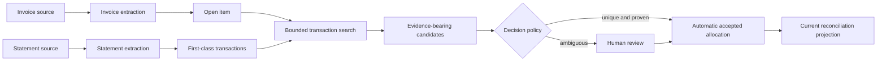

# Automatic invoice-to-bank-transaction reconciliation

Status: shared-solver extraction, scoped matching and human-confirmed relationships implemented on device and server; automatic settlement architecture proposed

Audience: contributors to document ingestion, Artifact Store schemas, Actor planning,
customer-data services, finance views, and bank connectors

## Purpose

After avenCEO understands an invoice and an account statement, it should be able to say
which bank transaction paid that invoice, show the evidence for the conclusion, and keep
the relationship current as more documents arrive. The common exact case should complete
automatically. Ambiguous, partial, aggregated, foreign-currency, or contradictory cases
should become small review tasks instead of silent guesses.

This paper specifies how to build that capability on the artifact-first document work in
[PR #188](https://github.com/MyAvenCEO/avenOS/pull/188). It extends
[Artifact-first semantic enrichment and affordance discovery](artifact-first-semantic-enrichment.md)
with the canonical facts, matching algorithm, decision boundary, automation loop, and
proof required for reconciliation. The implemented flow extracts and validates invoices
and statements, publishes canonical facts, queries a customer-scoped snapshot, ranks
bookings automatically and presents a comparison in the existing UI. A person's
confirmation or rejection publishes an immutable, evidence-linked decision. Both
placements use the general observation solver and the same domain contributions.
Global assignment, allocation projections and automatic settlement remain target
architecture; a confirmed `supports-booking` relationship is not a payment allocation.

The central rule is:

> Matching may be eager. Declaring a transaction to have settled an invoice requires a
> separate, inspectable decision.

That decision can be made automatically by a narrow policy Actor when the evidence is
strong and unique. A score, model answer, or top-ranked row is never itself a decision.

## Starting point and missing pieces

PR #188 establishes a useful extraction boundary:

- `bookkeeping.invoice-candidate@1` contains supplier, invoice number, currency, gross
  amount, due date, and a compact summary;
- `bookkeeping.invoice-details@2` adds issue date, parties, banking accounts, payment
  terms, payment observations, and references;
- `banking.account-statement-candidate@2` contains account identity, period, balances,
  and up to 128 extracted transaction rows; and
- the document Actors attach field or row evidence and production provenance to those
  outputs.

On PR #188 alone those are extraction proposals. The implemented skill now closes
extraction-to-review orchestration without asking a model to compare the raw documents
again. Remaining boundaries concern stronger accounting claims: the snapshot query is
not evidence that every bank statement was imported, the 64-occurrence shortlist may
truncate, and there is no global allocation ledger or automatic decision policy.

Historical avenOS work validates several parts of this shape. The statement fan-out card
made transaction rows queryable and idempotent; the first reconciliation card required an
amount match and used counterparty and sign as supporting evidence; and the transaction
view distinguished “document linked” from “booked.” See
[statement transaction fan-out](../libs/aven-board/board/ship/0065-bank-statement-tx-fanout.md),
[invoice-to-transaction reconciliation](../libs/aven-board/board/ship/0066-invoice-tx-reconciliation.md),
and [transaction reconciliation status](../libs/aven-board/board/ship/0081-tx-reconciliation-status-column.md).
Those cards are historical records, not current contracts. In particular, an amount-first
top-row heuristic is useful for recall but is insufficient authority for automatic
acceptance.

The earlier `avenCEO-tools` implementation provides a second useful prototype. For one
selected bank row, it lists accepted documents, compares both booked and original-currency
amounts, computes date distance, groups likely duplicate documents, orders the closest rows,
and lets the person attach a selection. Reconciliation should preserve that fast retrieval
and side-by-side interaction. It should replace the prototype's mutable JSON lookup and
manual attachment with first-class transaction artifacts, explicit evidence features,
global assignment, and a durable decision.

## The intended experience

The smallest successful journey is:



The product then shows one of five truthful states:

| State | Meaning |
| --- | --- |
| Not searched | No reconciliation run has covered this open item yet |
| Search incomplete | Relevant accounts or periods are missing, stale, truncated, or unauthorized |
| No candidate found | A complete recorded search found no candidate under the named matcher version |
| Needs review | One or more plausible candidates exist, but automatic-decision gates did not pass |
| Reconciled | An automatic policy decision or authenticated human decision accepted an exact allocation |

“No candidate found” is stronger than an empty query result. It is available only when
the search result records a closed corpus and no ingestion gap. “Reconciled” is stronger
than “top candidate.” It requires a decision artifact.

## Canonical artifact vocabulary

The implementation uses or proposes the following concrete artifact vocabulary:

| Artifact | Required meaning | This branch |
| --- | --- | --- |
| `banking.statement@1` | Validated statement identity, account, period, balances, row count, and extraction coverage | Registered and produced |
| `banking.transaction@1` | One immutable posted transaction occurrence with signed amounts, dates, account identity, counterparty, remittance fields, and source position | Registered and produced |
| `bookkeeping.open-item@1` | The settlement obligation derived from exact invoice artifacts, including direction, amount due, currency, dates, parties, bank identifiers, and payment references | Registered and produced |
| `reconciliation.search-result@1` | A generation-pinned, bounded search observation with account and date scope, completeness, gaps, counts, and ordered transaction references | Proposed |
| `reconciliation.match-candidate@2` | One proposal with feature outcomes, blockers, rank score, and required exact transaction input ordinal | Registered and produced by the ranking Actor using matcher `invoice-transaction-v2` |
| `reconciliation.decision@1` | Immutable human acceptance or rejection of a `supports-booking` relationship, with exact candidate/open-item/transaction inputs | Registered and produced by explicit review |
| `reconciliation.match-decision@1` | Accepted, rejected, or superseded disposition produced by either a policy Actor or a human-backed selection Actor | Proposed |
| `reconciliation.report@1` | One run's totals, unresolved items, corpus coverage, matcher and policy versions, and decision references | Proposed |

`policy.snapshot@1` already has the right role for the exact reconciliation policy used by
a run. A human approval remains a `review.decision@1` with the match candidate as its
subject. An automatic decision consumes the same candidate and policy snapshot but is
published by a dedicated policy evaluator.

### Promote statement rows without losing occurrence identity

A deterministic statement normalizer consumes the statement candidate and validation. It
publishes one `banking.statement@1`; a separate deterministic fan-out Actor publishes one
`banking.transaction@1` per accepted row in batches of at most 64, respecting the Artifact
Store publication limit while retaining stable row ordinals. Each transaction contains:

- `accountRef`, derived from a normalized IBAN or an opaque connector account ID;
- `providerTransactionId` when the source supplies one;
- `bookingDate` and `valueDate` as validated civil dates;
- signed `amountMinor` and `currency` for the account amount;
- optional signed `originalAmountMinor`, `originalCurrency`, exchange rate, and fee;
- counterparty name and IBAN;
- purpose, end-to-end ID, bank reference, and transaction type when available; and
- `sourceRow` or connector position.

In the implemented slice, fan-out production runs consume the canonical statement, candidate,
and validation, while JSON-pointer evidence maps every transaction back to its exact source
row. That run lineage provides the causal relationship. A later navigational manifest may add
ordered transaction references without mutating the already-published statement; equal JSON or
equal bytes do not make two occurrences identical.

Replay identity should be based on the source statement artifact, normalizer version, and
row ordinal. Cross-statement deduplication is a separate domain decision:

- the same account plus a stable bank transaction ID can resolve to one canonical
  transaction projection;
- a connector-specific immutable resource ID can serve the same purpose; and
- a hash of date, amount, and purpose is only a duplicate candidate because two legitimate
  payments can share those values.

Overlapping monthly exports must not create two spend events, but the system must retain
both source occurrences and their evidence. The current projection may coalesce proven
duplicates; immutable history does not.

The `transactions` limit in `banking.account-statement-candidate@2` is also a correctness
boundary. A statement with more than 128 rows, an omitted page, or an extractor-reported
truncation cannot support automatic reconciliation until the extraction protocol emits
segments or otherwise proves complete coverage. Validation should compare source row
counts, page coverage, opening and closing balances where possible, and the published
member count.

### Derive an open item from both invoice outputs

The compact invoice candidate and complete details are complementary inputs. The open-item
normalizer should consume both, plus invoice validation when available. It should not copy
only the gross total and supplier name.

The normalized artifact needs:

- an `invoiceBusinessKey` based on resolved supplier identity plus invoice number, while
  retaining the printed values separately; this is a duplicate-resolution candidate rather
  than artifact identity, because a supplier may reuse or correct a number;
- `direction`: `payable`, `receivable`, or `unknown` relative to the customer environment;
- `documentKind`, issue date, due date, and service period when useful;
- signed settlement expectation, amount due in minor units, and currency;
- supplier, buyer, beneficiary, creditor IBAN, and resolved party references;
- invoice number, order number, mandate, creditor, and other reference entries;
- observed prior payments and remaining amount; and
- validation status and confidence/evidence pointers for every field used in matching.

Direction must be established from account ownership and party roles. An invoice payable by
the customer normally expects an outgoing transaction; a customer-issued invoice normally
expects an incoming transaction; a credit note reverses the expectation. When ownership or
document semantics are unresolved, the item may be ranked but cannot be auto-reconciled.

Duplicate invoice ingestion should resolve before matching. Two file occurrences may support
one business open item, but they must not independently claim two payments. A correction or
new extraction publishes a new open-item version and updates a mutable preferred-version
projection; it never rewrites the earlier artifact.

## Matching is retrieval, comparison, assignment, then decision

One function that scans every transaction and returns the highest number hides too many
different claims. The production path should have four explicit stages.

### 1. Retrieve a high-recall shortlist

The transaction index is a customer-scoped projection over committed
`banking.transaction@1` artifacts. A retrieval Actor receives one open item and an admitted
search policy. It pins the projection generation or Artifact Store feed sequence and searches
only authorized accounts.

The initial window should be generous enough for early payments and late settlement. A useful
default is from 30 days before the invoice issue date through 120 days after the due date,
bounded by available statement periods. Both values belong in the policy snapshot, not in
source code. If issue or due date is absent, the policy defines the fallback window and marks
the weaker basis.

Candidate retrieval uses indexed features for recall:

- compatible currency and amount bands, including the transaction's original currency
  amount;
- normalized invoice, order, mandate, creditor, and end-to-end references in remittance
  text;
- exact counterparty IBAN or a resolved party relationship;
- normalized counterparty tokens; and
- the allowed booking/value-date window.

The output is a `reconciliation.search-result@1`, not an unrecorded database query. It names
the query, account set, date window, pinned generation, transactions considered and returned,
statement periods, and every completeness gap. A complete negative result is possible only
when required statements or connector captures cover the whole window through the pinned
generation.

### 2. Compare each open-item and transaction pair

Comparison should begin with deterministic features over canonical fields. A model may later
rerank ambiguous structured candidates, but it must not see credentials, fetch missing bank
data, invent fields, or directly accept a match.

| Dimension | Strong support | Conflict or limitation |
| --- | --- | --- |
| Amount | Exact minor-unit amount in the same currency; or exact original amount and currency | Unexplained delta, wrong currency, or missing amount blocks exact one-to-one automation |
| Direction | Transaction sign agrees with payable, receivable, or credit-note semantics | Unknown open-item direction or opposite sign blocks automation |
| Reference | Boundary-aware exact invoice, end-to-end, mandate, creditor, or order reference | Substring-only and short numeric matches are weak; an incompatible exact reference is a conflict |
| Account/party | Exact IBAN or resolved stable party | Fuzzy name alone is supporting evidence, never identity |
| Date | Booking/value date is plausible relative to issue, due, and observed payment dates | Date distance ranks candidates but rarely proves payment by itself |
| Availability | Neither side has a current accepted incompatible allocation | Existing accepted allocation blocks another one-to-one decision |
| Extraction | Used fields have valid schemas, adequate evidence, and no unresolved validation conflict | Truncation, contradictory totals, or low-confidence critical fields block automation |

String normalization should be deterministic, versioned, and locale-aware: Unicode
normalization, case folding, punctuation and legal-suffix handling, IBAN whitespace removal,
and token-boundary matching. Raw values and evidence remain unchanged. Reference matching must
avoid treating invoice `12` as a match inside `3129`.

The candidate records every feature outcome and blocker code. `rankScore` orders candidates;
it is not presented as probability. `calibratedProbability` remains absent until it has been
measured against labeled examples for the exact matcher version and document population.

### 3. Solve the assignment globally

Matching each invoice independently can assign the same transaction twice. For each affected
account and time window, the coordinator should build a bipartite graph:

```text
open items  <---- evidence-bearing candidate edges ---->  bank transactions
```

Version 1 admits only `one-open-item : one-transaction` automatic assignments. It chooses the
maximum-weight compatible assignment, subject to these invariants:

- a transaction has at most one current accepted one-to-one allocation;
- a fully settled open item has at most one current accepted one-to-one allocation;
- an edge with a hard blocker is never selected;
- an automatic edge must be the unique best choice for both endpoints; and
- its margin over the next compatible edge for either endpoint must meet policy.

This mutual-uniqueness rule handles the common “two invoices for the same monthly amount” case:
neither is auto-matched merely because each sees the same bank row first.

Partial payments, one bank transfer covering several invoices, processor payouts, fees,
discounts, and refunds use an allocation topology with explicit amounts. The invariant then
applies to allocated minor units: allocations may not exceed either transaction funds or open
amounts. Those topologies should remain review-only until their dedicated solvers and goldens
exist.

### 4. Make a separate decision

The initial automatic policy should be rule-based and deliberately narrow. An exact
one-to-one candidate may be accepted automatically only when all of these gates pass:

1. invoice and transaction extraction are complete and schema-valid;
2. direction is known and the transaction sign agrees;
3. amount and currency are exact, using account amount or the explicit original amount;
4. invoice-specific identity evidence exists: a boundary-safe exact invoice, order,
   end-to-end, mandate, or creditor reference; or resolved party identity plus exact
   beneficiary IBAN and independent date/payment evidence allowed by policy;
5. there is no conflicting exact reference or current allocation;
6. the candidate is the unique mutual best match with the required margin;
7. the pinned search corpus has no gap that could change the uniqueness claim; and
8. the policy version permits automatic acceptance for this document kind, account, source,
   and topology.

Recurring equal-amount payments without invoice-specific evidence remain review-only even
when one row happens to be the nearest date. The initial policy has no generic percentage or
minor-unit tolerance: “exact” means equal integer amounts in the compared currency. A later
discount, fee, or rounding rule must name its business basis explicitly.

Passing those gates causes a policy-evaluation run to publish
`reconciliation.match-decision@1` with `outcome: accepted`, `decidedBy: policy`, exact allocation
amounts, reason codes, and references to the candidate and `policy.snapshot@1`. It does not
silently mutate the candidate.

A candidate that fails an automation gate can still be useful. The UI presents the ranked
evidence and accepts an authenticated human decision. A selection Actor then consumes the
candidate, `review.decision@1`, and policy snapshot to publish the same match-decision shape
with `decidedBy: human`.

Rejecting a candidate records durable negative feedback scoped to that pair and evidence
version. Correcting an invoice or importing a newer statement may create a new candidate; the
old rejection is not a permanent ban on different evidence.

## Keep current state as a projection

Artifacts preserve what was extracted, proposed, and decided. Product queries still need a
current answer. A reconciliation component in the customer database should own projections
such as:

| Projection | Purpose |
| --- | --- |
| `transaction_index` | Searchable normalized fields and source coverage for committed transaction artifacts |
| `open_item_index` | Preferred open-item version, remaining amount, and current status |
| `match_candidate_index` | Current candidates, blockers, rank, and review state |
| `accepted_allocations` | Current accepted invoice-to-transaction allocations with uniqueness and amount constraints |
| `reconciliation_jobs` | Idempotent work keyed by trigger artifacts, matcher version, and policy version |

These tables are rebuildable from immutable artifacts and production runs. They are not a
second source of historical truth.

The decision coordinator must serialize claims for the affected open items and transactions.
It pins the projection high-water mark, verifies current constraints, publishes with a stable
idempotency key, and advances the projection from the resulting Artifact Store commit. An
outbox and replayable projector bridge crashes between publication and projection. Duplicate
workers converge on one publication and one active allocation; they do not each accept the
same money independently.

If later evidence invalidates an accepted match, the system publishes a superseding decision
and marks the current projection `needs-review`. It does not delete the earlier decision or
silently transfer the payment to another invoice. If a bookkeeping or payment system was
already changed, reversal is a separately authorized effect.

## Actor and skill composition

The reconciliation skill should expose small capabilities rather than one finance Actor that
parses documents, searches data, calls a model, and writes bookkeeping state.

| Capability | Mode | Requires | Produces |
| --- | --- | --- | --- |
| Statement normalization | `transform` | statement candidate and validation | statement, transaction occurrences, coverage report |
| Open-item normalization | `transform` | invoice candidate, invoice details, and validation | open item |
| Transaction retrieval | `observe` | open item, search policy, pinned index | search result |
| Pair comparison | `transform` | open item, transaction, search result, matcher policy | match candidate |
| Assignment | `transform` | candidate set and assignment policy | assignment proposal/report |
| Automatic policy decision | `transform` | eligible candidate and exact policy snapshot | match decision |
| Human-backed selection | `transform` | candidate, human decision, and policy snapshot | match decision |
| Bookkeeping update | `effect` | accepted match, approval/policy, exact target state | request and executor receipt |

The enrichment run may normalize statement rows and derive an invoice open item because those
steps add local typed knowledge. Candidate discovery is also a non-external operation and can
run automatically. An accepted local reconciliation assertion requires the separate policy
step above. Writing the relationship into external bookkeeping, closing a payable in another
system, or initiating a payment remains an `effect` with its own authorization and receipt.

The planner must not bind every transaction in a customer database into one unbounded `many`
slot. Retrieval is an observation frontier: it publishes a bounded search result, whose
transaction references enable pair-comparison capabilities on the next plan segment. This
also makes the exact search corpus and negative-result boundary inspectable.

## Automatic operation when either side arrives

Automation should be driven by committed facts, not UI presence:

1. The Artifact Store commit feed reports a new preferred open item or canonical transaction.
2. The reconciliation projector advances to that commit and enqueues an idempotent job.
3. A new open item searches transactions; a new transaction searches unsettled open items.
4. Related events from one atomic statement publication are coalesced before assignment.
5. The runner retrieves, compares, assigns, and evaluates policy against a pinned snapshot.
6. Exact unique cases publish an automatic decision. Ambiguous cases create or update one
   review task rather than notifying once per candidate.
7. The report and current projections update from committed outputs.

The trigger key should include the exact input artifact IDs, matcher version, policy version,
and index generation. Replaying the same key returns the same publication. A new extraction,
policy, matcher, or transaction corpus can intentionally produce a new run.

Jobs should be debounced for short bursts such as a multi-statement import, but automation
must not depend on a wall-clock race. Assignment is rerun against the pinned complete set after
the burst. Authorization, artifact access, Actor availability, and customer routing are checked
again at invocation.

## Getting statements automatically through HTTP

Automatic reconciliation becomes more useful when bank data arrives without manual statement
uploads. [PR #189](https://github.com/MyAvenCEO/avenOS/pull/189) supplies the right generic
network boundary, with one important limit: its version-1 authenticated route requires an
active user session and therefore does not yet authorize unattended background synchronization.

The session-admitted path is:

```text
authenticated connector observation
  -> secret-free web.http-request artifact
  -> authenticated HTTP resource Actor
  -> effective immutable response artifact and body
  -> bank-specific JSON, CSV, MT940, or CAMT materializer
  -> canonical statement and transaction artifacts
  -> reconciliation trigger
```

The reconciliation Actor should never contain an API token or make an ad hoc bank request.
Every durable credential belongs to PR #189's customer-scoped Vault component in the selected
customer database. A structured binding authorizes the normalized bank host, path, exact
`GET` or `HEAD` method, and read purpose; the trusted server transport resolves one
request-scoped header, cookie, or query attachment under the original active session. The
portable Actor, request artifact, run, and receipt never receive the secret.

Authenticated fetch is server-only in version 1. A workload credential alone is insufficient,
and a durable run pauses when the user session expires. Static bearer/API-key headers, cookies,
and query keys are the initial attachment forms. OAuth refresh, request signing, client
certificates, mutable cookie jars, and multi-value credentials require later typed Vault
attachments and lifecycle proofs. A bank API that requires `POST` even for a read also lies
outside the generic version-1 `GET`/`HEAD` Actor; it needs a separately specified read
capability rather than silently widening the generic fetch contract.

The exact effective response is captured before a domain parser uses it, so every transaction
can be traced to the bytes or JSON that supplied it. A connector must treat response status as
observed data: a retained `401`, `429`, or `500` response does not advance account coverage or
the pagination cursor. Transport, size, decoding, or staging failure publishes no partial
response and leaves the capture incomplete.

### Freshness, cache identity, and pagination

PR #189 defaults resource reads to `freshness: revalidate`. Its response lookup is partitioned
by customer environment, scope, principal, stable Vault credential reference, normalized
method and URL, representation-selecting headers, and `Vary`. Reconciliation inherits those
rules. A response fetched for one customer, remote login, or account context must never satisfy
another partition merely because its URL or ETag matches.

For a bank collection endpoint, `offline-only` may replay previously captured material but
cannot extend a coverage claim. `revalidate` is the normal incremental mode. `new-capture` is
reserved for an admitted policy that really needs to bypass validators. A `fresh-cache` result
adds no new remote observation. A successful `304` revalidation creates a new effective
response occurrence that points to the prior response and reuses its exact blob; it proves the
representation remained current at the new observation time.

Revalidating an unchanged page must not create duplicate canonical transactions. The
materializer's replay identity therefore includes the effective response representation,
connector parser version, account resource, and row identity, while its observation lineage
also retains the new `304` response occurrence.

Pagination is a bank-specific observation above the one-exchange HTTP Actor. It publishes or
retains an ordered page-capture manifest containing every effective response, requested account
and period, terminal cursor observation, capture time, and gaps. Coverage becomes complete only
after the connector observes the provider's terminal page under one admitted capture. A failed,
revoked, rate-limited, or session-expired page leaves the manifest incomplete, so a later
reconciliation search cannot claim “no candidate found.”

The stable Vault credential reference is a cache partition, not a bank-account identity. One
credential may authorize several accounts. `accountRef` must come from the admitted connector
resource and validated bank response, and the connector must prove that every returned row
belongs to that account.

Scheduling and connector cursors are connector state, not invoice-match fields. Each completed
capture records freshness, account, requested period, response artifacts, and completeness.
Rate limits, cursor replay, revocation, and retry remain inside the connector and HTTP runtime
boundaries.

### Unattended synchronization is a separate authority

PR #189 intentionally does not let a service reuse Vault credentials after the user's session
expires. Therefore a timer cannot simply replay a stored `web.http-request@1` overnight. The
first bank integration can refresh while the person is authenticated, then run reconciliation
automatically over the resulting durable transactions.

True unattended synchronization requires a later delegated connector-session contract. It
must name the customer, remote connection, allowed accounts, origins, methods, read purposes,
schedule, expiry, revocation behavior, and maximum data window; give Vault a distinct
background-use action; and remain narrower than a general service credential. OAuth refresh,
when needed, belongs to that connector/Vault lifecycle. This authority must be designed and
proved before the product describes bank collection as continuous or scheduled.

The proposed generic HTTP Actor admits only resource reads. If a bank or bookkeeping API is
later asked to mark a record reconciled, that is an effect-specific request/receipt Actor with
idempotency and ambiguous-outcome recovery.

## Difficult cases

Version 1 should rank these cases but keep them out of automatic acceptance unless the named
specialized rule is present:

| Case | Required treatment |
| --- | --- |
| Foreign currency | Prefer exact `originalAmountMinor` and `originalCurrency`; retain booked amount, rate, and fees. Auto only with exact reference or party evidence and complete FX fields. |
| Partial payments | Create several allocations against remaining amount. Require review until sequence, rounding, and overpayment behavior are proven. |
| Batch payment | Solve one transaction to several open items with explicit allocated amounts and references. Never duplicate the full bank amount onto every invoice. |
| Discount or skonto | Derive an allowed settlement amount from explicit invoice terms and payment date; a generic tolerance is insufficient. |
| Bank fee | Represent fee separately or through a specialized allocation. Do not widen the amount threshold globally. |
| Credit note or refund | Reverse direction according to document and account roles; do not rely on absolute amount alone. |
| Card processor payout | Reconcile against a provider settlement manifest before individual invoices. A net payout is not one invoice payment. |
| Standing order | Recurrence can support ranking but can also create repeated equal-amount ambiguity. It never establishes invoice identity alone. |
| Cash receipt | No bank transaction may exist. Record another settlement method rather than fabricating a bank match. |
| Duplicate invoice file | Resolve occurrences to one business open item before matching. Keep every source occurrence and duplicate decision. |
| Corrected extraction | Publish new facts and superseding decisions. Never rewrite evidence or silently move an accepted link. |

## Product presentation

The primary review should put invoice and transaction side by side and answer four questions:

1. What is being linked?
2. Which evidence supports it?
3. What conflicts or coverage gaps remain?
4. Who or what accepted it under which policy?

Amount, currency, sign, reference, party/IBAN, and date should appear as individual evidence
rows with source links. A label such as “exact amount” is more useful than a bare `0.93` score.
When a calibrated probability exists, show it as additional information, not as the reason the
decision is valid.

The transaction list should project separate states such as `Document linked`, `Reconciled`,
and `Booked`. An accepted match does not prove an external ledger entry, and a bookkeeping
receipt does not erase the evidence or decision that led to it.

Review actions are accept, reject, choose another candidate, split/allocate, or correct source
facts. Accepting binds the exact candidate version shown. If the candidate or source changes
while the review is open, the action fails stale and renders the newer evidence.

## Safety and data boundaries

Reconciliation operates only inside the authorized customer environment. The transaction
index, open-item index, jobs, policy snapshots, candidates, and decisions belong in that
customer database under a dedicated component and least-privilege roles. A caller cannot
choose another customer database, broaden account scope through query fields, or infer that a
hidden transaction exists from a score or blocker.

Critical values use integer minor units and validated ISO currency codes. Dates are civil dates
until a source actually supplies an instant. Normalized search fields are projections, never
replacements for printed or bank-supplied values. Model prompts receive only the bounded
structured candidate data and evidence needed for an admitted ambiguous comparison.

The system should log artifact, run, policy, and safe reason identifiers. It should not log
raw statements, invoice contents, credentials, full IBANs, remittance text, or model payloads
by default.

## Proof strategy

The deterministic merge-blocking corpus should enter through the same product boundaries as
real uploads and assert durable outputs. Its minimum case contains one invoice, one exact
transaction, one same-amount distractor, and one unrelated row. The exact transaction should
win for inspectable reference or party evidence, not because the fixture name is recognized.

### Current executable flow and validation boundaries

`DocumentProcessingRuntime` executes the catalog in `skill.ts` through
`executeObservedProgram`. Only committed observations unlock more work. Exact sealed
page and transaction-batch collections drive fan-out/gathers. Extraction revision
bindings prevent candidate, details and validation from different runs being joined.
Successful invocation publications replay before an Actor is invoked again.

CSV files have an earlier, mandatory human checkpoint. Only exact reviewed export
profiles with unambiguous account, currency, dates and valid complete rows may reach
document-type review; a model's confidence score cannot substitute for these checks.
The solver requires a committed human confirmation bound to the original file digest
and detection revision before producing financial statement candidates or bookings.
This decision is separate from accepting an invoice-to-booking relationship. Unknown
formats and ambiguous rows stay blocked, with no manual override into reconciliation.
The [CSV corpus](../fixtures/golden/bank-csv/README.md) records eight synthetic layouts
and their sources; only one checked-in layout currently passes every admission check.
That narrow coverage is not a measured near-100% recognition rate or proof of origin.

Replayable inspection is `core.file-inspection@2`, with its decoded-page blob required.
The new inspection and match schemas have new versions; the original version-one
definitions remain byte-for-byte unchanged. Immutable registered contracts are not
rewritten when a skill gains new behavior, and there is no legacy execution branch.

`reconcileInvoices` uses that engine for typed snapshot retrieval, amount-first
shortlisting, the production ranking Actor, and review preparation. It retains both
booked and original-currency comparisons from the prototype. Provider-ID conflict
groups stay together; fingerprint-only repeated rows stay distinct. Ranking compares
the invoice gross amount, not the remaining balance of an already-paid invoice.
Unicode letters and digits survive identity normalization. Reused customer references
cannot establish invoice-specific eligibility, and contradictory FX signs block it.

Importing either document first works. A subsequent import reruns retrieval over the
new snapshot. The native app uses its existing comparison layout and buttons; the
model can request review but cannot invoke confirmation. `decideReconciliation`
admits an explicit effect and stores exactly three evidence inputs. Publication
identity is fixed to the invoice/transaction pair, so duplicate acknowledgement and
contradictory retries cannot create a second decision for that pair. Rejection can
show the next candidate. Reversing a saved decision is not yet supported.

The snapshot freezes published occurrences, not real-world bank coverage. Queries
currently use the publication sequence without a restore epoch token; do not span
an environment restore with an active review/query session. Start a fresh session
after restore. Successful publication replay is durable, but failed local attempts,
per-step claims and host cancellation propagation are not a complete execution
journal. These are limits of the current implementation, not claims of automatic
financial settlement.

### Current validation corpus and constraints

The suite committed with the first implementation slice is primarily an engineering
regression corpus. It proves deterministic transformations, publication contracts, lineage,
and conservative abstention. It does not measure real-world reconciliation accuracy and must
not be used as evidence for enabling automatic decisions.

At this revision the reconciliation-specific coverage consists of:

- hand-authored deterministic cases in
  [`reconciliation.test.ts`](../libs/aven-document-ingest/tests/reconciliation.test.ts),
  covering normalization, provider-ID grouping and distinct fingerprint rows, booked versus original FX
  amounts, the 128-row extraction ceiling, the 64-artifact publication boundary, reference
  boundaries, duplicate observations, IBAN-only abstention, unknown direction, unverified
  coverage, ranking output, and input lineage;
- document-runtime tests in
  [`document-actors.test.ts`](../app/tests/document-actors.test.ts), including one synthetic
  invoice path and one synthetic 65-row statement path with stable 64+1 replay identities;
- publication allowlist and attribution tests in
  [`artifacts.test.ts`](../services/aven-api/tests/artifacts.test.ts);
- schema-registration and representative-payload validation inside the Artifact Store core;
  and
- a shared-flow suite with both import orders, pagination, truncation, conflicting
  provider observations, lost acknowledgements, replay and rejected alternatives in
  [`reconciliation-flow.test.ts`](../libs/aven-document-ingest/tests/reconciliation-flow.test.ts);
- a real Rust Artifact Store/PostgreSQL financial flow with production decoders and
  Actors, restart replay, local/server equality, decisions and scope denial in
  [`reconciliation.persistence.e2e.test.ts`](../services/actor-runner/tests/reconciliation.persistence.e2e.test.ts);
- native Tauri PDF imports, CSV document confirmation and separate invoice-match
  confirmation on Device and Server in [`platform.spec.ts`](../deploy/e2e/platform.spec.ts);
- 13 [synthetic market PDFs](../fixtures/golden/reconciliation-market/README.md),
  exact decoder/text assertions, seven independent matching policy scenarios,
  and opt-in real-model extraction against authored field expectations;
- seven checksum-pinned [public issuer specimens](../fixtures/golden/public-documents/README.md),
  covering 17 decoded pages and two opt-in blank-form safety cases; and
- the historical Actor Runner happy-path ranking case plus negative-route and omitted-output
  cases in
  [`artifact-first-enrichment.e2e.test.ts`](../services/actor-runner/tests/artifact-first-enrichment.e2e.test.ts).

Those tests have important boundaries:

| Constraint | Consequence |
| --- | --- |
| Matcher fixtures are small, synthetic, and authored from the implementation rules | They detect regressions but cannot estimate recall, precision, calibration, or performance on unseen documents |
| Fast document-runtime tests use a fixed decoder, hard-coded model responses, and an in-memory publication gateway | They isolate scheduling and provenance; the separate real-store and native rails prove transport and persistence |
| The 65-row statement is a batching boundary test with mechanically generated rows | It proves 64+1 publication and replay behavior, not realistic statement diversity or row-extraction quality |
| The API tests use a mocked Artifact Store backend | They prove server-side client-procedure allowlists and envelopes, but not a real API-to-Artifact-Store transaction or tenant database migration |
| Core schema tests use representative payloads; the real-store flow publishes the financial graph | Neither constitutes exhaustive schema fuzzing |
| The provider-backed tests are explicit opt-ins: two reviewed OCR goldens, 13 synthetic market documents and two public blank-form negatives | They prove those inputs on the selected model, not statistical accuracy; ordinary offline tests skip them |
| Native PDF/CSV reconciliation runs use deterministic model output by default and an optional real provider on both execution placements | Both modes prove the tested product path; neither establishes diverse bank/supplier recognition, and the real-store image rail substitutes model responses |
| Public specimens are official examples, not labeled customer invoices paired with actual bookings; five have only checksum/decoding assertions | Their presence is not evidence of successful financial extraction; synthetic official-notice coverage remains exploratory |
| The historical Actor Runner E2E uses test-only predicates and actors | Production normalizers and the ranker are additionally exercised through the observation solver in the new real-store and native rails |
| Document-derived statement coverage deliberately remains `unverified` | Current document uploads can produce ranked review candidates, but cannot exercise a legitimate automatic-decision success case |
| Customer-scoped retrieval and human decisions exist; global assignment, supersession and allocation projections do not | No mutual-uniqueness or double-allocation guarantee follows from accepting a supporting-document relationship |
| Name normalization preserves Unicode but remains heuristic | The suite does not establish multilingual matching quality, legal-suffix handling or transliteration accuracy |

There are also no production-labeled invoice/transaction pairs, held-out evaluation split,
property-based allocation tests, bank-connector captures, or measured false-positive
confidence interval. The suite therefore qualifies deterministic orchestration and
human-backed reconciliation. It does not support claims about automatic-match precision or
launch readiness.

Verification checkpoint, 2026-09-06: the continuation passed 89 document-ingest
tests, 178 app tests, 27 Actor Runner tests, and the native harness's ten real-store/
runner checks plus 64 checkout checks. The ordinary document suite intentionally
skips 24 optional provider/public-cache cases. Separately, the configured
`qwen3.8-flash-next` endpoint with the `qwen-tools` adapter passed both original OCR
goldens, all 13 market documents and both public blank-form negatives. All seven
public specimens also passed pinned-byte and page-count checks. These are individual
observations, not an accuracy estimate or a guarantee about future model revisions.

The native rail passes with deterministic output and with the actual provider on
both placements, including separate CSV classification and relationship decisions.
The final fresh-build runs took 28.1 seconds with deterministic output and 2.2 minutes
with the real provider; both retained the 180-second journey limit.
A live run also hit the 60-second remote-statement wait without a terminal result;
the original run had no intermediate server progress, so its cause was not established.
Subsequent proof includes live stage/attempt progress and a regression preventing
monitoring errors from leaving a permanently active desktop status. The overall
journey remains limited to 180 seconds; busy or unavailable providers can still
make an opt-in run fail. No expected finance values were loosened to pass a model.

The full repository lint command is not green: 1,295 pre-existing errors remain,
including existing formatting in `GatePreview.svelte`. No new lint errors remain
in changed files; its only markup change adds a test selector, without a layout
or style change. Documentation, type checks, scoped Rust tests and the infrastructure,
bootstrap, deployment-validation and disposable backup/restore gates passed.
The owning [test procedures](operations/build-and-test.md) define how to repeat these
checks; optional model runs must be explicitly configured.

Required deterministic cases include:

- exact same-currency payable, receivable, credit note, and payment receipt;
- same amount with two plausible invoices, proving no double or arbitrary auto-match;
- same invoice imported twice and overlapping statements imported twice;
- account amount versus original FX amount;
- missing pages, more than 128 source rows, stale projection, and incomplete pagination;
- conflicting totals, missing currency, unknown direction, weak OCR, and ambiguous dates;
- partial, batch, fee, discount, standing-order, refund, and processor-payout cases;
- human accept, human reject, stale review, correction, supersession, and reversal;
- two workers racing to accept the same transaction;
- crash before publication, after publication, and before projection checkpoint;
- replay under the same matcher/policy version and intentional rerun under a new version;
- customer and account isolation, expired grants, and unauthorized corpus gaps; and
- Vault cache isolation by customer, principal, credential reference, URL, headers, and
  `Vary`;
- session expiry during a multi-page bank capture, proving the run pauses and coverage remains
  incomplete;
- fresh-cache, `304` revalidation, changed-body, `401`, `429`, and transport-failure outcomes,
  proving only complete successful captures advance coverage and no unchanged response creates
  duplicate transactions;
- presence of an external bookkeeping effect Actor, proving candidate discovery does not
  invoke it.

Property tests should enforce conservation and uniqueness: accepted allocations never exceed
transaction or open-item amounts, no active one-to-one endpoint is used twice, order of input
arrival does not change the canonical result, and replay adds no new business decision.

Provider-backed document goldens continue to measure extraction quality. A separate labeled
reconciliation dataset measures candidate recall, review rate, calibration, and—most
importantly—automatic-match precision. The first release target should favor abstention. A
false automatic match is materially worse than a correct case sent to review.

Before automatic decisions are enabled, the matcher should run in shadow mode on reviewed
data. The rollout report records at least:

- candidate recall at `k`;
- precision and a confidence interval for the exact auto-eligible policy slice;
- false-match and double-allocation counts;
- coverage-gap and abstention rates;
- review acceptance, rejection, and correction rates; and
- metrics by document kind, currency, account source, and matcher version.

An uncalibrated rank score must not be renamed “confidence” to meet a launch threshold.

## Implementation sequence

### Slice 1: canonical finance facts and manual reconciliation

1. **Implemented:** register statement, transaction, open-item, and match-candidate schemas.
   Human relationship decisions are also registered. Accounting search-result/report
   artifacts and allocation/supersession rules remain proposed.
2. **Implemented:** add replay-safe statement fan-out in bounded publications. Document-derived
   coverage stays `unverified`, and hitting 128 rows becomes `row-limit-reached`.
3. **Implemented:** add invoice-to-open-item normalization using both PR #188 invoice outputs.
4. **Implemented:** retrieve immutable customer-scoped transactions and open items at
   one publication watermark. Dedicated accounting projections remain proposed.
5. **Implemented:** compose retrieval and the deterministic comparator/ranking Actor
   through the general observation solver on both hosts.
6. **Implemented:** present ranked candidates and publish human-backed relationship
   decisions through the existing comparison control.

The implemented flow records “this invoice supports this booking” after a person's
confirmation. The remaining slices below strengthen that claim to automatic settlement
and more complex accounting relationships; they are not implemented by a rank score.

### Slice 2: safe automatic exact matches

1. Add global one-to-one assignment and coordinator serialization.
2. Publish and validate the narrow auto-match policy snapshot.
3. Run shadow evaluation on labeled cases and retain matcher receipts.
4. Enable automatic decisions only for the exact, complete, unique policy slice.
5. Add stale-evidence handling, supersession, and notification deduplication.

### Slice 3: session-admitted bank observations

1. Land PR #189's generic authenticated HTTP resource and customer Vault boundaries.
2. Add one server-side, read-only `GET`/`HEAD` bank connector compatible with the initial
   static Vault attachment forms.
3. Prove private cache partitioning, ETag revalidation, effective-response lineage,
   pagination, cursor replay, revocation, session expiry, rate limits, and complete period
   capture.
4. Trigger the same reconciliation path from connector-published transactions while the bank
   fetch itself remains session-admitted.

### Slice 4: unattended bank observations

Specify and prove a revocable delegated connector-session and background Vault-use action,
plus OAuth or other credential lifecycle support required by the chosen bank. Only after this
slice may a scheduler collect new bank data without an active user session.

### Slice 5: complex allocations and external bookkeeping

Add partial and batch allocation solvers, explicit discount and fee rules, provider settlement
manifests, and effect-specific bookkeeping request/receipt Actors. Each new topology earns its
own policy gate and golden corpus before it becomes automatic.

## Completion criteria

The initial automatic reconciliation feature is complete only when all of the following are
true:

1. statement rows and invoice obligations are first-class, schema-valid artifacts with exact
   source evidence;
2. a search result can prove its corpus scope and distinguish incomplete from not found;
3. every candidate explains amount, currency, direction, reference, party, date, conflicts,
   and matcher version;
4. global assignment and current projections prevent double allocation under concurrency;
5. automatic acceptance publishes a separate decision against an exact policy snapshot;
6. ambiguous cases remain reviewable and bind decisions to the exact evidence shown;
7. replay, correction, supersession, and crash recovery preserve immutable history and one
   current answer;
8. no reconciliation step performs a payment or external bookkeeping write implicitly;
9. deterministic end-to-end, property, isolation, and failure tests pass; and
10. shadow-mode evidence demonstrates the required automatic-match precision for the enabled
    policy slice.

At that point automation is not a hidden heuristic attached to document upload. It is a
composed, evidence-bearing skill: extraction creates trustworthy finance facts, retrieval says
what was searched, comparison proposes relationships, assignment prevents collisions, policy
or a person decides, and effects remain separately authorized.
